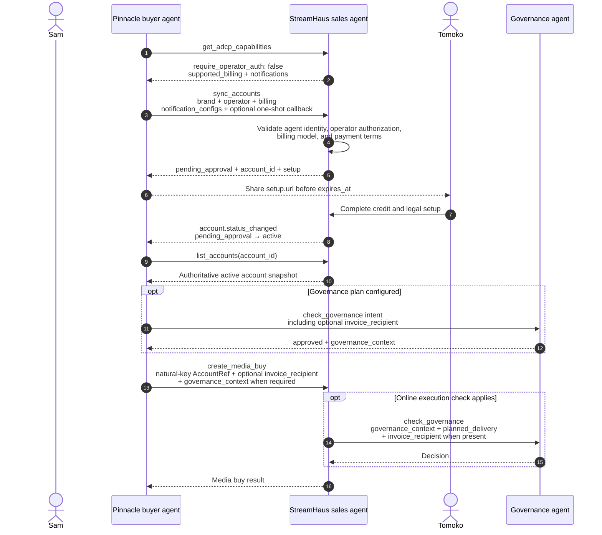

This walkthrough follows one buyer-declared account from discovery to its first media buy. It focuses on the case where a seller provisions the relationship but a human must finish credit or legal setup before the account becomes active.

## Scenario

Tomoko at Nova Motors has asked Sam's Pinnacle Agency buyer agent to buy inventory from Priya's StreamHaus sales agent. Nova Motors is the advertiser, Pinnacle Agency is the operator, and Nova Motors should receive the invoice.

The StreamHaus account does not exist yet. Sam must discover the seller's account model, request provisioning, give Tomoko the setup link, observe activation, reconcile the webhook against the seller's current state, and only then create a media buy.

## Before you provision

This flow applies only when [`get_adcp_capabilities`](/dist/docs/3.2.0-rc.4/protocol/get_adcp_capabilities) returns `account.require_operator_auth: false`. In that model, the seller trusts the authenticated buyer agent to declare a brand and operator through [`sync_accounts`](/dist/docs/3.2.0-rc.4/accounts/tasks/sync_accounts).

If `require_operator_auth` is `true`, stop here. The operator authenticates directly and the buyer discovers a seller-assigned `account_id` through [`list_accounts`](/dist/docs/3.2.0-rc.4/accounts/tasks/list_accounts) or receives it during out-of-band onboarding. Do not attempt natural-key provisioning unless a future capability explicitly declares it.

Before sending the request, Sam also checks:

- `account.supported_billing` includes the desired `advertiser` value.
- `account.notifications.supported` is `true` and the declared event types include `account.status_changed` if the buyer wants durable lifecycle notifications.
- Nova Motors' brand registry authorizes `pinnacle-agency.example` to operate for the brand.
- The authenticated buyer agent is allowed to establish this brand/operator relationship.

When durable account notifications are unavailable, the buyer may still use the one-shot `sync_accounts.push_notification_config` callback for the original provisioning task and poll `list_accounts` for later status changes.

## End-to-end sequence



## Discover the account model

Sam calls `get_adcp_capabilities` before choosing an account workflow. The relevant capability fragment looks like this:

```json
{
  "$schema": "https://adcontextprotocol.org/schemas/3.2.0-rc.4/protocol/get-adcp-capabilities-response.json",
  "status": "completed",
  "adcp": {
    "major_versions": [3],
    "supported_versions": ["3.1", "3.2-beta"],
    "idempotency": {
      "supported": true,
      "replay_ttl_seconds": 86400
    }
  },
  "supported_protocols": ["media_buy"],
  "account": {
    "require_operator_auth": false,
    "supported_billing": ["operator", "agent", "advertiser"],
    "supported_account_currency_modes": ["fixed", "per_media_buy"],
    "timezone": {
      "mode": "account_fixed",
      "account_selection": "buyer_selected",
      "supported_timezones": ["Europe/London", "UTC"]
    },
    "notifications": {
      "supported": true,
      "registration_task": "sync_accounts",
      "read_task": "list_accounts",
      "event_types": ["account.status_changed"],
      "supports_webhook_activity": true
    }
  }
}
```

`require_operator_auth: false` selects buyer-declared provisioning. `supported_billing` tells Sam which invoiced parties the seller accepts at the capability level; it does not guarantee that every authenticated buyer agent is commercially authorized for every advertised value. `supported_account_currency_modes` tells Sam whether to include one immutable account `currency`, omit it for per-media-buy selection, or choose either model. The timezone capability requires Sam to choose one advertised immutable account timezone and include it in the natural key.

The `notifications` block selects the preferred observation strategy: register a durable subscriber during provisioning, treat each webhook as an invalidation signal, and repair from `list_accounts`. If the block is absent or `supported` is `false`, poll instead.

## Request provisioning

Sam sends a fresh `idempotency_key`, the Nova Motors brand, Pinnacle Agency as operator, the advertised billing model, and the requested payment terms. The same account entry registers a durable lifecycle subscriber. The top-level `push_notification_config` is optional and applies only to the async result of this provisioning task; it does not replace the durable subscriber.

{/* account.status_changed is a next-minor surface; the stable v3 alias resolves to it when that release becomes current. */}

**Schema:** [`sync-accounts-request.json`](https://adcontextprotocol.org/schemas/3.2.0-rc.4/account/sync-accounts-request.json)

```json
{
  "$schema": "https://adcontextprotocol.org/schemas/3.2.0-rc.4/account/sync-accounts-request.json",
  "idempotency_key": "2fc44b7a-6c1c-4cb9-83da-bdcce1b6c0f8",
  "accounts": [
    {
      "brand": {
        "domain": "novamotors.example"
      },
      "operator": "pinnacle-agency.example",
      "timezone": "Europe/London",
      "billing": "advertiser",
      "billing_entity": {
        "legal_name": "Nova Motors Ltd.",
        "registration_number": "NM-2026-1042",
        "address": {
          "street": "12 Aurora Road",
          "city": "London",
          "postal_code": "SW1A 1AA",
          "country": "GB"
        },
        "contacts": [
          {
            "role": "billing",
            "name": "Tomoko",
            "email": "accounts-payable@novamotors.example"
          }
        ]
      },
      "payment_terms": "net_30",
      "notification_configs": [
        {
          "subscriber_id": "account-lifecycle",
          "url": "https://buyer.pinnacle-agency.example/webhooks/adcp/accounts",
          "event_types": ["account.status_changed"],
          "active": true
        }
      ]
    }
  ],
  "push_notification_config": {
    "url": "https://buyer.pinnacle-agency.example/webhooks/adcp/tasks",
    "operation_id": "provision-nova-streamhaus-2026-08-12"
  }
}
```

Priya's seller validates the authenticated agent identity and its authority to represent the operator and brand. It either accepts the billing model and payment terms exactly as requested or rejects the account entry; it must not silently substitute a different payer or terms.

The seller also validates the durable endpoint and completes its proof-of-control challenge before marking the subscriber active. It assigns an `account_id` before activation so later account lifecycle events can always identify an authoritative repair target, even while approval remains pending.

The account needs a human credit and legal review, so StreamHaus returns `pending_approval`:

**Schema:** [`sync-accounts-response.json`](https://adcontextprotocol.org/schemas/3.2.0-rc.4/account/sync-accounts-response.json)

```json
{
  "$schema": "https://adcontextprotocol.org/schemas/3.2.0-rc.4/account/sync-accounts-response.json",
  "status": "completed",
  "accounts": [
    {
      "account_id": "acct_streamhaus_nova_pinnacle",
      "name": "Nova Motors c/o Pinnacle Agency",
      "brand": {
        "domain": "novamotors.example"
      },
      "operator": "pinnacle-agency.example",
      "timezone": "Europe/London",
      "action": "created",
      "status": "pending_approval",
      "billing": "advertiser",
      "billing_entity": {
        "legal_name": "Nova Motors Ltd.",
        "registration_number": "NM-2026-1042",
        "address": {
          "street": "12 Aurora Road",
          "city": "London",
          "postal_code": "SW1A 1AA",
          "country": "GB"
        },
        "contacts": [
          {
            "role": "billing",
            "name": "Tomoko",
            "email": "accounts-payable@novamotors.example"
          }
        ]
      },
      "payment_terms": "net_30",
      "account_scope": "operator_brand",
      "setup": {
        "url": "https://onboarding.streamhaus.example/accounts/acct_streamhaus_nova_pinnacle",
        "message": "Complete the StreamHaus credit application and media terms.",
        "expires_at": "2026-08-19T17:00:00Z"
      },
      "notification_configs": [
        {
          "subscriber_id": "account-lifecycle",
          "url": "https://buyer.pinnacle-agency.example/webhooks/adcp/accounts",
          "event_types": ["account.status_changed"],
          "active": true
        }
      ]
    }
  ]
}
```

The response may echo the seller's `account_id`. In this workflow, Sam stores it for webhook correlation and `list_accounts` repair. It does not replace the natural key: later buyer-declared operations continue to use Nova Motors' `brand` plus Pinnacle Agency's `operator` in `AccountRef`.

If the request included bank details, the response must not echo `billing_entity.bank`; bank fields are write-only.

## Complete human setup

Sam presents `setup.message` to Tomoko and shares `setup.url` before `setup.expires_at`. The URL is optional in the protocol, so an implementation must also handle a message-only response by directing the human to the seller's established support or onboarding channel.

Tomoko follows the StreamHaus URL, completes the credit application, and accepts the media terms. Sam must not send a media buy while the authoritative account status remains `pending_approval`.

Setup URLs can expire or be single-use. If one is missing, expired, or already consumed, Sam re-reads `list_accounts` for current instructions rather than relying on an old response or webhook payload.

## Observe and reconcile resolution

After approval, StreamHaus sends the durable subscriber a complete `account.status_changed` event. The receiver verifies the webhook signature, scopes deduplication to the authenticated sender, and deduplicates retries by `idempotency_key`.

**Schema:** [`account-status-changed-webhook.json`](https://adcontextprotocol.org/schemas/3.2.0-rc.4/core/account-status-changed-webhook.json)

```json
{
  "$schema": "https://adcontextprotocol.org/schemas/3.2.0-rc.4/core/account-status-changed-webhook.json",
  "idempotency_key": "whk_01J5C8PX4W6EJYNRDT30M0VN4A",
  "notification_id": "acctchg_streamhaus_nova_20260812T143000Z",
  "notification_type": "account.status_changed",
  "fired_at": "2026-08-12T14:30:03Z",
  "subscriber_id": "account-lifecycle",
  "account_id": "acct_streamhaus_nova_pinnacle",
  "previous_status": "pending_approval",
  "status": "active",
  "observed_at": "2026-08-12T14:30:00Z",
  "reason_code": "seller_approved"
}
```

The event's `status` and `reason_code` are advisory. It deliberately omits the complete account and any `setup.url`. Sam immediately calls `list_accounts` with the echoed `account_id`; that authenticated read is the source of truth.

**Request:**

```json
{
  "$schema": "https://adcontextprotocol.org/schemas/3.2.0-rc.4/account/list-accounts-request.json",
  "account": {
    "account_id": "acct_streamhaus_nova_pinnacle"
  }
}
```

**Schema:** [`list-accounts-response.json`](https://adcontextprotocol.org/schemas/3.2.0-rc.4/account/list-accounts-response.json)

```json
{
  "$schema": "https://adcontextprotocol.org/schemas/3.2.0-rc.4/account/list-accounts-response.json",
  "status": "completed",
  "accounts": [
    {
      "account_id": "acct_streamhaus_nova_pinnacle",
      "name": "Nova Motors c/o Pinnacle Agency",
      "brand": {
        "domain": "novamotors.example"
      },
      "operator": "pinnacle-agency.example",
      "status": "active",
      "billing": "advertiser",
      "billing_entity": {
        "legal_name": "Nova Motors Ltd.",
        "registration_number": "NM-2026-1042",
        "address": {
          "street": "12 Aurora Road",
          "city": "London",
          "postal_code": "SW1A 1AA",
          "country": "GB"
        },
        "contacts": [
          {
            "role": "billing",
            "name": "Tomoko",
            "email": "accounts-payable@novamotors.example"
          }
        ]
      },
      "payment_terms": "net_30",
      "account_scope": "operator_brand",
      "notification_configs": [
        {
          "subscriber_id": "account-lifecycle",
          "url": "https://buyer.pinnacle-agency.example/webhooks/adcp/accounts",
          "event_types": ["account.status_changed"],
          "active": true
        }
      ]
    }
  ]
}
```

If durable notifications are unavailable, Sam polls `list_accounts` by the known account reference until it returns `active`, `rejected`, or another state that requires action. The same repair read should run periodically even with webhooks so missed, delayed, or distrusted fires cannot leave local state stale.

## Use the active account

Once the authoritative snapshot is `active`, Sam can call [`create_media_buy`](/dist/docs/3.2.0-rc.4/media-buy/task-reference/create_media_buy). Because this is a buyer-declared account, the request uses the durable natural-key reference:

The example below assumes no governance plan is configured. When governance applies, Sam first sends the full intended payload, including any `invoice_recipient`, to `check_governance`. Only an `approved` decision yields the `governance_context` that Sam attaches to `create_media_buy`; `conditions` requires an adjusted intent re-check, and `denied` stops the buy. A seller that declares online execution checks then validates its `planned_delivery` with the same context before committing, forwarding `invoice_recipient` as the execution check's separate top-level field when the buy supplied one.

```json
{
  "$schema": "https://adcontextprotocol.org/schemas/3.2.0-rc.4/media-buy/create-media-buy-request.json",
  "idempotency_key": "a9f52ca1-346b-40f3-8bad-0b96381470bc",
  "account": {
    "brand": {
      "domain": "novamotors.example"
    },
    "operator": "pinnacle-agency.example"
  },
  "brand": {
    "domain": "novamotors.example"
  },
  "start_time": "2026-09-01T00:00:00Z",
  "end_time": "2026-09-30T23:59:59Z",
  "total_budget": {
    "amount": 50000,
    "currency": "GBP"
  },
  "packages": [
    {
      "product_id": "streamhaus-connected-tv",
      "pricing_option_id": "cpm-standard",
      "budget": 50000
    }
  ]
}
```

An optional `invoice_recipient` can override the account's default billing entity for this media buy. The seller validates that the caller is authorized to use the recipient. When governance agents are configured, the seller includes the override in [`check_governance`](/dist/docs/3.2.0-rc.4/governance/campaign/tasks/check_governance) so the billing redirect can be approved or rejected. See [Billing entity and invoice recipient](/dist/docs/3.2.0-rc.4/building/by-layer/L2/accounts-and-agents#billing-entity-and-invoice-recipient).

## Obligations by party

| Stage | Buyer agent | Seller agent | Human |
|---|---|---|---|
| Discovery | Read `require_operator_auth`, choose a value advertised in `supported_billing`, and select webhook or polling observation. | Accurately declare the supported account model, billing values, and durable notification capability. | — |
| Provisioning | Send a fresh `idempotency_key`, brand, operator, billing choice, and any requested terms. Do not send the settings-update `account` field in the same entry. | Authenticate the agent; validate brand/operator authority, billing permission, terms, and webhook control. Accept exact billing and terms or reject them without remapping. | — |
| Pending setup | Surface `setup.message` and any current URL and expiry. Do not spend yet. | Return `setup.message` for required action and, when available, a URL and expiry. Never expose write-only bank data. | Complete the seller's credit, legal, or payment steps. |
| Resolution | Deduplicate the fire, treat it as advisory, and repair through `list_accounts`. Poll when durable notifications are unavailable. | Fire `account.status_changed` to active subscribers and make the authoritative state available through `list_accounts`. | Respond to renewed setup instructions if the account is not active. |
| Media buy | Use the natural-key `AccountRef`; send an override only when authorized. | Permit new spend only for an active account. Validate `invoice_recipient` and pass it to governance when configured. | Approve any campaign-specific billing override required by local policy. |

## Failure branches

- **The seller requires operator authentication.** Do not use this provisioning flow. Authenticate the operator and resolve a seller-assigned `account_id` through `list_accounts` or out-of-band onboarding.
- **The billing value is not advertised.** Choose a supported value with the invoiced party's approval or stop for commercial onboarding. The seller returns `BILLING_NOT_SUPPORTED` for a seller-wide mismatch.
- **The buyer agent lacks permission for an advertised billing value.** The seller rejects with the narrower authenticated-agent billing error, such as `BILLING_NOT_PERMITTED_FOR_AGENT`. When `error.details.suggested_billing` is present, the buyer may make one autonomous retry with exactly that value. If no suggestion is present or that retry is also rejected, stop and require human onboarding; do not keep changing who owes money.
- **Payment terms are unacceptable.** The seller rejects the account entry. It must not silently change `net_30` to another term.
- **Brand or operator authorization fails.** Correct the brand registry or authenticated relationship before retrying. Reuse the same idempotency key only when retrying the same logical request after an ambiguous transport outcome; use a new key for a materially changed request.
- **Webhook validation or activation proof fails.** The seller rejects the account entry and leaves the previous subscriber set unchanged. Correct the endpoint, then retry provisioning safely.
- **The account is rejected.** Read the explanation from `warnings[]`; there is no `account.reason` field. Escalate to a human or submit a materially corrected request with a new idempotency key.
- **The setup link is absent or expired.** Fetch the current account through authenticated `list_accounts`. The lifecycle webhook never carries `setup.url`.
- **No durable notification arrives.** Poll `list_accounts`. The one-shot task callback covers only the original provisioning result and is not a lifecycle subscription.
- **The repair read is not active.** Honor the returned state. `pending_approval`, `payment_required`, `suspended`, `rejected`, and `closed` do not permit a new media buy.
- **Billing must change after provisioning.** Do not send `billing` in settings-update mode; billing is fixed at provisioning. Follow the seller's commercial process or establish the appropriate new account relationship.
- **A per-buy invoice override is rejected.** If the seller does not authorize `invoice_recipient`, or governance denies the override, the seller rejects the media buy. The buyer may use the already-authorized account default after obtaining any required fresh governance approval, or escalate to a human; it must not silently reroute the invoice.

## Related reference

- [`get_adcp_capabilities`](/dist/docs/3.2.0-rc.4/protocol/get_adcp_capabilities) — account model, supported billing, and durable-notification discovery
- [`sync_accounts`](/dist/docs/3.2.0-rc.4/accounts/tasks/sync_accounts) — provisioning fields, setup results, and account-level subscriptions
- [`list_accounts`](/dist/docs/3.2.0-rc.4/accounts/tasks/list_accounts) — authoritative state and webhook repair
- [Accounts and agents](/dist/docs/3.2.0-rc.4/building/by-layer/L2/accounts-and-agents) — account references, billing roles, and authorization models
- [`create_media_buy`](/dist/docs/3.2.0-rc.4/media-buy/task-reference/create_media_buy) — the first spend operation after activation
- [`check_governance`](/dist/docs/3.2.0-rc.4/governance/campaign/tasks/check_governance) — governance review of campaign-specific invoice recipients
