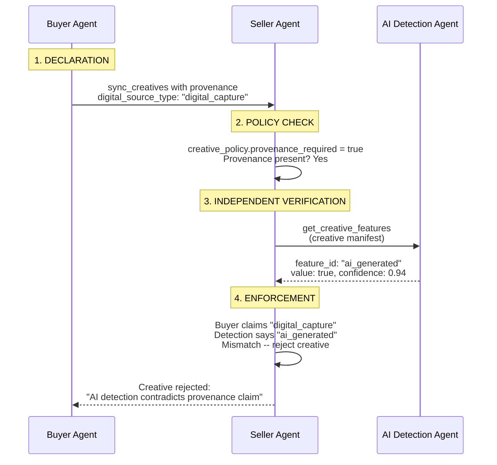

Provenance metadata declares how creative content was produced — whether AI was involved, which tools were used, and what disclosure obligations the declaring party believes apply. Regulations like the EU AI Act and California SB 942 place disclosure obligations on deployers and covered platforms; AdCP carries the structured provenance signals those parties rely on through the programmatic supply chain so every participant can declare, transmit, and verify the same data. Provenance attaches to creative manifests, individual assets, or content-standards artifacts. It is a claim by the declaring party — receiving parties verify claims independently using their own detection tools.

<Info>
EU AI Act Article 50 enforcement begins August 2026. California SB 942 is already in effect. Major platforms mandate AI content labeling today. AdCP carries the structured, machine-readable provenance and disclosure metadata these regulations rely on through the programmatic supply chain, where no standard for it previously existed. The protocol moves the data; the legal obligation still sits with the deployer making the disclosure to the end user.
</Info>

## The provenance object

Provenance is an optional object that can attach to creative assets, creative manifests, individual typed assets, and content artifacts. No fields are required at the provenance level -- each section is independently useful.

**Schema**: [provenance.json](https://adcontextprotocol.org/schemas/3.2.0-rc.4/core/provenance.json)

| Field | Type | Description |
|-------|------|-------------|
| `digital_source_type` | enum | IPTC-aligned classification of AI involvement |
| `synthetic_depiction` | boolean | Assessed declaration that a real or fictional person is synthetically depicted; omission means unassessed |
| `ai_tool` | object | AI system used (`name` required, plus optional `version` and `provider`) |
| `human_oversight` | enum | Level of human involvement in the creation process |
| `declared_by` | object | Party attaching this provenance claim (`role` required, plus optional `agent_url`) |
| `declared_at` | string (date-time) | When this provenance claim was made (ISO 8601), distinct from `created_time` |
| `created_time` | string (date-time) | When the content was created (ISO 8601) |
| `c2pa` | object | C2PA sidecar manifest reference (`manifest_url` required). Breaks under ad-server transcoding — use `embedded_provenance` for pipelines with intermediaries |
| `embedded_provenance` | array | Provenance metadata embedded *within* the content stream (manifest wrapper or invisible markers); survives transcoding and re-encoding |
| `watermarks` | array | Content watermarks encoding an identifier or fingerprint; survives perceptual transformations |
| `disclosure` | object | Regulatory disclosure requirements and jurisdiction details |
| `verification` | array | Third-party verification or detection results |
| `ext` | object | Standard extension point |

### Minimal example

Most provenance declarations answer one question: **was this AI-generated, and does it need a disclosure label?**

```json
{
  "$schema": "/schemas/3.2.0-rc.4/core/provenance.json",
  "digital_source_type": "trained_algorithmic_media",
  "disclosure": {
    "required": true
  }
}
```

That's it. `digital_source_type` says how the content was produced. `disclosure.required` says whether it needs a label. Everything else — tool details, C2PA references, jurisdiction-specific render guidance, verification results — is optional context that supply-chain participants can add when they need it.

For content with no AI involvement, provenance is even simpler:

```json
{
  "$schema": "/schemas/3.2.0-rc.4/core/provenance.json",
  "digital_source_type": "digital_capture"
}
```

### Synthetic depiction

`synthetic_depiction` answers a narrower question than `digital_source_type`: does the creative depict a real or fictional person performing or appearing in a way that was generated or materially manipulated rather than captured as depicted? It is an assessed boolean declaration, not a three-state enum:

| Case | Declaration |
|---|---|
| Fully synthetic human performer | `synthetic_depiction: true` |
| Real performer materially manipulated to say, do, or appear as something not captured | `synthetic_depiction: true` |
| Synthetic content with no human depiction, such as a generated landscape or product rendering | `synthetic_depiction: false` after assessment |
| Creative not assessed for synthetic depiction | Omit `synthetic_depiction` |

Both `true` and `false` mean the creative was assessed. Omission means unassessed; it does not mean false. The value is independent of `digital_source_type`, so receivers MUST NOT infer one from the other.

<Warning>
`synthetic_depiction` is only a declaration about what the content depicts. It does not state that a depicted person consented, that the use is legal, or that an independent verifier confirmed the claim. Those determinations remain separate policy, rights, and verification concerns.
</Warning>

### Full example

```json
{
  "$schema": "/schemas/3.2.0-rc.4/core/provenance.json",
  "digital_source_type": "trained_algorithmic_media",
  "ai_tool": {
    "name": "DALL-E 3",
    "version": "3.0",
    "provider": "OpenAI"
  },
  "human_oversight": "selected",
  "declared_by": {
    "agent_url": "https://creative.pinnaclemedia.example.com",
    "role": "agency"
  },
  "declared_at": "2026-02-15T14:35:00Z",
  "created_time": "2026-02-15T14:30:00Z",
  "c2pa": {
    "manifest_url": "https://cdn.pinnaclemedia.example.com/c2pa/manifests/hero_img_abc123.c2pa"
  },
  "disclosure": {
    "required": true,
    "jurisdictions": [
      {
        "country": "US",
        "region": "CA",
        "regulation": "ca_sb_942",
        "label_text": "Created with AI",
        "render_guidance": {
          "persistence": "flexible",
          "positions": ["prominent", "footer"]
        }
      },
      {
        "country": "DE",
        "regulation": "eu_ai_act_article_50",
        "label_text": "KI-generiert",
        "render_guidance": {
          "persistence": "continuous",
          "positions": ["overlay", "subtitle"]
        }
      }
    ]
  },
  "verification": [
    {
      "verified_by": "Reality Defender",
      "verified_time": "2026-02-15T15:00:00Z",
      "result": "ai_generated",
      "confidence": 0.97,
      "details_url": "https://realitydefender.example.com/reports/abc123"
    }
  ]
}
```

## Digital source type

The `digital_source_type` enum classifies AI involvement in content production, aligned with the [IPTC digitalsourcetype vocabulary](https://cv.iptc.org/newscodes/digitalsourcetype/).

**Schema**: [digital-source-type.json](https://adcontextprotocol.org/schemas/3.2.0-rc.4/enums/digital-source-type.json)

| Value | Description | When to use |
|-------|-------------|-------------|
| `digital_capture` | Captured by a digital device (camera, scanner, screen recording) with no AI involvement | Photos from a product shoot, screen recordings of app demos |
| `digital_creation` | Created by a human using digital tools (Photoshop, Illustrator, After Effects) without AI generation | Hand-designed banner ads, manually composed layouts |
| `trained_algorithmic_media` | Generated entirely by a trained AI model (DALL-E, Midjourney, Stable Diffusion, Sora) | AI-generated hero images, AI-produced video spots |
| `composite_with_trained_algorithmic_media` | Human-created content combined with AI-generated elements | Product photo with AI-generated background, human-shot video with AI visual effects |
| `algorithmic_media` | Produced by deterministic algorithms without machine learning (procedural generation, rule-based systems) | Programmatic visualizations, procedural pattern generation |
| `composite_capture` | Multiple digital captures composited together without AI | Panoramic stitching, multi-exposure HDR composites |
| `composite_synthetic` | Composite of multiple elements where at least one is AI-generated | Stock photo composited with AI-generated background, AI text overlay on captured video |
| `human_edits` | Content augmented, corrected, or enhanced by humans using non-generative tools | Color-corrected product photography, manually retouched portraits, human copy editing |
| `data_driven_media` | Assembled from structured data feeds (DCO templates, product catalogs, weather-triggered variants) | Dynamic creative optimization, catalog-driven product carousels, weather-responsive ads |

### Choosing the right value

For mixed-production creatives, choose the value that best describes the **overall creative** at the level where provenance is attached. If you need to distinguish AI involvement per-asset, attach provenance at the individual asset level instead (see [Inheritance](#inheritance) below).

Common patterns:

- **AI image + human copy**: Attach `trained_algorithmic_media` to the image asset, `digital_creation` to the text asset, and `composite_with_trained_algorithmic_media` at the manifest level
- **DCO with AI-generated headlines**: `data_driven_media` at the manifest level, `trained_algorithmic_media` on the AI-generated text assets
- **Human photographer + AI background removal**: `composite_with_trained_algorithmic_media` at the manifest level

## Human oversight

The `human_oversight` enum describes the level of human involvement in an AI-assisted creation process.

| Value | Description |
|-------|-------------|
| `none` | Fully automated with no human involvement in generation |
| `prompt_only` | Human provided the prompt or instructions but did not review outputs |
| `selected` | Human selected from multiple AI-generated candidates |
| `edited` | Human edited or refined AI-generated output |
| `directed` | Human directed the creative process with AI as an assistive tool |

This field is relevant when `digital_source_type` indicates AI involvement. For non-AI content, omit it.

<Warning>
`human_oversight` and `disclosure.required` are independent fields, and the protocol does not derive one from the other. Some regulations carve out human-edited or human-directed AI output from disclosure obligations (for example, EU AI Act Article 50(4) where a human takes editorial responsibility), and the protocol leaves that determination to the declaring party's legal analysis. Asserting `human_oversight: edited` or `directed` does not by itself justify `disclosure.required: false` — the carve-out has factual prerequisites the schema cannot evaluate. Sellers and governance agents may treat the combination as an audit-worthy claim and require corroborating evidence from the declaring party.
</Warning>

Governance agents surface this audit-worthy pattern through `get_creative_features.audit_observations[]` using `OVERSIGHT_DISCLOSURE_CARVEOUT_CLAIMED`. That observation is not a rejection code by itself; it lets sellers retain or route the claim for audit while the creative continues through normal review.

## Inheritance

Provenance attaches at three levels in the creative hierarchy. The most specific provenance wins, and replacement is **full-object** -- there is no field-level merging.

```
creative-asset.provenance        (1) default for the creative in the library
  creative-manifest.provenance   (2) default for this manifest
    individual asset .provenance (3) override for a specific asset
```

### Resolution rules

1. If an individual asset has `provenance`, use it
2. Otherwise, if the manifest has `provenance`, use it
3. Otherwise, if the creative asset has `provenance`, use it
4. Otherwise, no provenance is declared for that asset

### Example: mixed creative

A creative where the image is AI-generated but the copy is human-written. The manifest-level provenance covers the overall creative. The image asset overrides with its own, more specific provenance.

```json
{
  "$schema": "/schemas/3.2.0-rc.4/core/creative-manifest.json",
  "format_kind": "image",
  "provenance": {
    "digital_source_type": "composite_with_trained_algorithmic_media",
    "declared_by": { "role": "agency" }
  },
  "assets": {
    "banner_image": {
      "asset_type": "image",
      "url": "https://cdn.novabrands.example.com/hero_ai.jpg",
      "width": 300,
      "height": 250,
      "provenance": {
        "digital_source_type": "trained_algorithmic_media",
        "ai_tool": {
          "name": "DALL-E 3",
          "version": "3.0",
          "provider": "OpenAI"
        },
        "human_oversight": "selected",
        "declared_by": { "role": "agency" },
        "c2pa": {
          "manifest_url": "https://cdn.novabrands.example.com/c2pa/hero_ai.c2pa"
        }
      }
    },
    "headline": {
      "asset_type": "text",
      "content": "Nutrition dogs love"
    },
    "clickthrough_url": {
      "asset_type": "url",
      "url": "https://novabrands.example.com/products?campaign={MEDIA_BUY_ID}"
    }
  }
}
```

In this example:
- `banner_image` uses its own provenance: `trained_algorithmic_media` with full AI tool details
- `headline` inherits the manifest-level provenance: `composite_with_trained_algorithmic_media`
- `clickthrough_url` also inherits the manifest-level provenance

Note that the image's provenance is a complete replacement. Even though the manifest-level provenance has `declared_by`, the image asset must re-declare it in its own provenance object if that information should carry through.

### Artifact inheritance

For content artifacts (publisher content), the same pattern applies:

```
artifact.provenance                  (1) default for the artifact
  artifact.assets[].provenance       (2) override for a specific inline asset
```

```json
{
  "$schema": "/schemas/3.2.0-rc.4/content-standards/artifact.json",
  "property_rid": "01916f3a-a1d3-7000-8000-000000000030",
  "artifact_id": "article_ai_trends_2026",
  "provenance": {
    "digital_source_type": "digital_creation",
    "declared_by": { "role": "platform" }
  },
  "assets": [
    {
      "type": "text",
      "role": "title",
      "content": "AI trends reshaping the industry in 2026"
    },
    {
      "type": "image",
      "url": "https://cdn.aimagazine.example.com/illustration.jpg",
      "alt_text": "Conceptual illustration of neural networks",
      "provenance": {
        "digital_source_type": "trained_algorithmic_media",
        "ai_tool": { "name": "Midjourney", "version": "v7" },
        "human_oversight": "directed",
        "declared_by": { "role": "platform" }
      }
    }
  ]
}
```

The article text inherits `digital_creation` from the artifact. The illustration overrides with its own `trained_algorithmic_media` provenance.

## Trust model

<Warning>
Provenance is a **claim** by the declaring party. It is not proof. The enforcing party should verify independently.
</Warning>

In advertising, the party declaring provenance and the party enforcing it have competing incentives. A buyer submitting a creative has reason to claim the content is human-made — AI-generated creatives may face placement restrictions, mandatory disclosure labels, or outright rejection on certain inventory. A seller accepting that creative has the opposite incentive: publishing AI-generated content without proper disclosure creates regulatory liability for the publisher, not the advertiser. AdCP handles this tension by treating provenance as a claim, not a fact. The buyer declares; the seller verifies. Verification happens at each enforcement point independently, using AI detection services (via `get_creative_features`), C2PA manifest validation, or both. No party needs to trust any other party's assertion. The protocol provides the structure for claims and the integration points for verification — the supply chain provides the adversarial pressure that keeps both honest.

The `declared_by` field identifies who attached the provenance claim. The `verification` array carries any detection results the declaring party wants to disclose. But the party enforcing a provenance requirement runs its own verification through existing governance infrastructure.



### Declaring party roles

| Role | Description |
|------|-------------|
| `creator` | The party that created or generated the content |
| `advertiser` | The brand or advertiser that owns the content |
| `agency` | Agency acting on behalf of the advertiser |
| `platform` | Ad platform or publisher that processed the content |
| `tool` | Automated tool or service that attached provenance metadata |

### Buyer-attached verification

The `verification` array on the provenance object lets the declaring party share detection results for transparency. Multiple services can independently evaluate the same content:

```json
{
  "verification": [
    {
      "verified_by": "Hive Moderation",
      "verified_time": "2026-02-15T15:00:00Z",
      "result": "ai_generated",
      "confidence": 0.96,
      "details_url": "https://hive.example.com/reports/abc123"
    },
    {
      "verified_by": "Reality Defender",
      "verified_time": "2026-02-15T15:05:00Z",
      "result": "ai_generated",
      "confidence": 0.93
    }
  ]
}
```

These results are **supplementary**. A seller that requires provenance verification runs its own detection through [`get_creative_features`](/dist/docs/3.2.0-rc.4/governance/creative/get_creative_features) rather than trusting the buyer's attached results.

Verification results use one of four outcomes:

| Result | Description |
|--------|-------------|
| `authentic` | Content verified as non-AI-generated |
| `ai_generated` | Content detected as AI-generated |
| `ai_modified` | Content detected as AI-modified (original non-AI content with AI alterations) |
| `inconclusive` | Detection was unable to reach a confident determination |

### Example: provenance through a campaign

Acme Brands is running a spring campaign. Their agency, Meridian Media, uses an AI image generator to produce a set of display banners — photorealistic product shots with AI-generated backgrounds. Meridian attaches provenance to the creative manifest: `digital_source_type` is `composite_with_trained_algorithmic_media`, `ai_tool` identifies the generator, and `disclosure.required` is `true` with `eu_ai_act_article_50` and `ca_sb_942` listed as applicable regulations. For the EU jurisdiction, Meridian sets `render_guidance.persistence` to `continuous` with `positions` preferring `overlay` — expressing the EU AI Act's requirement for persistent labeling.

The campaign is submitted to Pinnacle Publishing through AdCP. Pinnacle's ad operations platform checks the provenance claim, then runs the creative through its verification pipeline via `get_creative_features`. The AI detection service returns `ai_modified` with 0.94 confidence — consistent with the declared source type. With the claim verified, Pinnacle applies its own jurisdictional policy — as the covered platform under SB 942, it makes its own disclosure determination rather than relying on Meridian's `disclosure.required: true` as authoritative — reads the render guidance for the serving jurisdiction, applies the disclosure label with the specified persistence, and clears the creative for serving. The provenance metadata, the detection result, the render guidance, and the disclosure decision are all recorded and auditable.

If Meridian had declared `digital_capture` instead — claiming no AI involvement — Pinnacle's detection service would have flagged the inconsistency. The creative would be held for review, not served.

## C2PA integration

The `c2pa` field provides a soft reference to [C2PA Content Credentials](https://c2pa.org/) -- the cryptographic provenance standard developed by the Coalition for Content Provenance and Authenticity.

```json
{
  "c2pa": {
    "manifest_url": "https://cdn.acmecorp.example.com/c2pa/manifests/hero_abc123.c2pa"
  }
}
```

### Why a URL reference

C2PA bindings are typically embedded in the media file itself. But ad tech pipelines routinely transcode, resize, and reformat creative assets -- breaking file-level C2PA bindings in the process. A URL reference to the original C2PA manifest store survives this transcoding, preserving the chain of provenance through the supply chain.

The reference is a pointer, not a replacement for C2PA. Any party in the chain can fetch the manifest from the URL and verify the original content credentials, even after the media file has been transcoded.

### Usage pattern

1. Creator generates content and produces a C2PA manifest
2. Creator uploads the manifest store to a stable URL
3. Creator attaches the `manifest_url` in AdCP provenance
4. Downstream parties (agencies, platforms, sellers) can verify the original credentials at any time by fetching the manifest

## Disclosure requirements

The `disclosure` object declares regulatory obligations for AI-generated content.

```json
{
  "disclosure": {
    "required": true,
    "jurisdictions": [
      {
        "country": "US",
        "region": "CA",
        "regulation": "ca_sb_942",
        "label_text": "Created with AI",
        "render_guidance": {
          "persistence": "flexible",
          "positions": ["prominent", "footer"]
        }
      },
      {
        "country": "DE",
        "regulation": "eu_ai_act_article_50",
        "label_text": "KI-generiert",
        "render_guidance": {
          "persistence": "continuous",
          "positions": ["overlay", "subtitle"]
        }
      },
      {
        "country": "CN",
        "regulation": "cn_deep_synthesis",
        "label_text": "AI-generated content",
        "render_guidance": {
          "persistence": "initial",
          "min_duration_ms": 3000,
          "positions": ["overlay", "pre_roll"]
        }
      }
    ]
  }
}
```

| Field | Required | Description |
|-------|----------|-------------|
| `required` | Yes | Whether AI disclosure is required based on applicable regulations |
| `jurisdictions` | No | Array of jurisdictions where disclosure obligations apply |
| `jurisdictions[].country` | Yes | ISO 3166-1 alpha-2 country code |
| `jurisdictions[].region` | No | Sub-national region code (e.g., `CA` for California) |
| `jurisdictions[].regulation` | Yes | Regulation identifier |
| `jurisdictions[].label_text` | No | Required disclosure label text in the local language |
| `jurisdictions[].render_guidance` | No | How the disclosure should be rendered for this jurisdiction |
| `jurisdictions[].render_guidance.persistence` | No | How long the disclosure must persist: `continuous`, `initial`, or `flexible` |
| `jurisdictions[].render_guidance.min_duration_ms` | No | Minimum display duration in milliseconds (required context for `initial` persistence) |
| `jurisdictions[].render_guidance.positions` | No | Preferred disclosure positions in priority order (first supported wins) |

### Render guidance

The `render_guidance` object on each jurisdiction expresses the declaring party's intent for how the disclosure should be rendered based on the regulation's requirements. Different regulations have different persistence requirements:

- **`continuous`** — The disclosure must remain visible or audible throughout the content display duration. For video/audio, the full playback. For static formats (display, DOOH), the full display slot. For DOOH, "content duration" means the ad's display slot within the rotation, not the screen's full rotation cycle.
- **`initial`** — The disclosure must appear at the start for a minimum duration before it may be removed. Pair with `min_duration_ms` to specify how long — without it, the duration is at the publisher's discretion.
- **`flexible`** — Disclosure presence is sufficient; the publisher controls timing and duration.

When multiple sources specify persistence for the same jurisdiction (e.g., brief `required_disclosures[].persistence` and provenance `render_guidance.persistence`), the most restrictive mode applies: `continuous` > `initial` > `flexible`.

The `positions` array is an ordered preference list. The first position that the serving format supports should be used. For example, `["overlay", "subtitle"]` means "prefer overlay, fall back to subtitle if overlay is not available."

Not all position-persistence combinations are meaningful. Positions with inherently bounded duration — `end_card`, `pre_roll` — cannot satisfy `continuous` persistence because they appear only for part of the content. Creative agents should not request `continuous` on these positions, and formats should not claim `continuous` support for them.

For audio-only environments (podcast, streaming audio, smart speakers), only `audio`, `pre_roll`, and `companion` positions are applicable. Visual positions (`overlay`, `footer`, `subtitle`) are undefined without a screen. Creative agents building for audio formats should restrict `render_guidance.positions` to audio-compatible values.

Render guidance travels with the creative through the supply chain. At serve time, the publisher reads the guidance from provenance and renders accordingly. Governance agents can audit whether the publisher followed the declared guidance.

### Multi-asset aggregation

When a creative is assembled from multiple assets with different `render_guidance` for the same jurisdiction (common in DCO), the most restrictive persistence applies across the assembled creative: if any asset requires `continuous`, the assembled creative requires `continuous`. This follows the same precedence as conflict resolution: `continuous` > `initial` > `flexible`.

### Enforcement vs self-reported compliance

For formats where the publisher controls the rendering surface (hosted video, display banners, SSAI), the publisher can enforce render guidance directly — rendering an overlay, controlling its duration, and verifying compliance.

For opaque, self-rendering creatives (MRAID, JavaScript tags, VPAID), the creative controls its own viewport. The publisher cannot inject or enforce disclosure rendering inside the creative's sandbox. In these cases, disclosure compliance depends on the creative agent embedding the disclosure during build. The format's `disclosure_capabilities` should reflect this: only claim persistence modes the format's rendering layer can verify or enforce, not modes that rely on creative self-compliance. Governance agents can verify self-rendered disclosures post-hoc via `get_creative_features` by rendering the creative in a headless environment and inspecting for disclosure presence.

### Known regulation identifiers

| Identifier | Regulation | Status |
|------------|-----------|--------|
| `eu_ai_act_article_50` | EU AI Act Article 50 | Enforcement August 2026 |
| `ca_sb_942` | California SB 942 | Live since January 2026 |
| `cn_deep_synthesis` | China Deep Synthesis Provisions | In effect |

Regulation identifiers are conventions, not a closed enum. New regulations can be referenced without protocol changes.

## Embedded provenance and watermarks

`c2pa.manifest_url` is a sidecar reference: a URL pointer to a detached cryptographic manifest. It is durable across the network, but file-level C2PA bindings do not survive ad-server transcoding, resize, or re-encode. For pipelines where assets pass through intermediaries before reaching the publisher, two transcoding-resilient fields carry provenance evidence inside the asset itself.

### `embedded_provenance[]`

Provenance metadata carried *within* the content stream — either as a manifest embedded in the file container (e.g., a JUMBF box in JPEG, a C2PATextManifestWrapper in plaintext per C2PA Section A.7) or as invisible markers in the content that encode or reference a provenance record.

```json
{
  "embedded_provenance": [
    {
      "method": "provenance_markers",
      "provider": "Encypher",
      "verify_agent": {
        "agent_url": "https://governance.encypher.example",
        "feature_id": "encypher.markers_present"
      },
      "embedded_at": "2026-04-30T10:15:00Z"
    }
  ]
}
```

| Field | Required | Description |
|---|---|---|
| `method` | Yes | `manifest_wrapper` or `provenance_markers` (see [`embedded-provenance-method`](https://adcontextprotocol.org/schemas/3.2.0-rc.4/enums/embedded-provenance-method.json)) |
| `provider` | Yes | Organization that performed the embedding (display label, not a wire identifier) |
| `standard` | No | Standard the embedding conforms to (e.g., `c2pa`) |
| `verify_agent` | No | AdCP governance agent that can verify this embedding via `get_creative_features` |
| `embedded_at` | No | When the embedding was applied (ISO 8601) |

`verify_agent` SHOULD be present for methods where the receiver cannot self-verify (e.g., `provenance_markers`); it MAY be omitted for self-verifiable embeddings such as a C2PA text manifest with a public key the receiver already trusts.

### `watermarks[]`

Content watermarks that encode an identifier or fingerprint within the asset. Distinct from embedded provenance: a watermark carries an identifier (who generated it, who owns it), while embedded provenance carries or references a structured provenance record (the full chain of custody). A single asset may carry both.

```json
{
  "watermarks": [
    {
      "media_type": "video",
      "provider": "Imatag",
      "verify_agent": {
        "agent_url": "https://governance.imatag.example",
        "feature_id": "imatag.watermark_detected"
      },
      "c2pa_action": "c2pa.watermarked.unbound"
    }
  ]
}
```

| Field | Required | Description |
|---|---|---|
| `media_type` | Yes | `audio`, `image`, `video`, or `text` (see [`watermark-media-type`](https://adcontextprotocol.org/schemas/3.2.0-rc.4/enums/watermark-media-type.json)) |
| `provider` | Yes | Organization that applied the watermark (display label, not a wire identifier) |
| `verify_agent` | No | AdCP governance agent that can detect this watermark via `get_creative_features` |
| `c2pa_action` | No | C2PA action classification: `c2pa.watermarked.bound` or `c2pa.watermarked.unbound` (see [`c2pa-watermark-action`](https://adcontextprotocol.org/schemas/3.2.0-rc.4/enums/c2pa-watermark-action.json)) |
| `embedded_at` | No | When the watermark was applied (ISO 8601) |

### The `verify_agent` shape

`verify_agent` is the buyer's *representation* that this layer can be verified by a governance agent the seller already accepts. The seller is the verifier-of-record: it publishes which agents it will call on `creative_policy.accepted_verifiers[]` (returned by `get_products`), and the buyer's `verify_agent.agent_url` MUST be a canonicalized match of one of those entries. Off-list URLs are rejected with `PROVENANCE_VERIFIER_NOT_ACCEPTED` before any outbound call.

This is buyer-supplied evidence, not buyer-driven routing. The seller chooses which agent it actually invokes, and may substitute a different on-list agent than the buyer nominated; it does not call buyer-asserted endpoints outside its allowlist.

| Field | Required | Description |
|---|---|---|
| `agent_url` | Yes | URL of the governance agent the buyer represents was used. MUST use `https://`. MUST match (canonicalized) one of the seller's `creative_policy.accepted_verifiers[].agent_url` values |
| `feature_id` | No | Feature ID the buyer represents was used. SHOULD match the `feature_id` declared on the corresponding `accepted_verifiers[]` entry, or be omitted to defer to the seller |

Buyers MAY omit `verify_agent` for self-verifiable embeddings (e.g., a C2PA text manifest with a public key the seller already trusts) — in that case, the seller selects an agent from `accepted_verifiers` at evaluation time.

Inheritance follows the same rule as the parent `provenance` object: most-specific wins, replacement is full-object, no field-level merging.

## Creative policy enforcement

Sellers express provenance requirements on `creative-policy` — a field on every Product, surfaced through `get_products` so buyers see requirements before submitting.

```json
{
  "$schema": "/schemas/3.2.0-rc.4/core/creative-policy.json",
  "co_branding": "optional",
  "landing_page": "any",
  "templates_available": false,
  "provenance_required": true,
  "provenance_requirements": {
    "require_digital_source_type": true,
    "require_synthetic_depiction": true,
    "require_disclosure_metadata": true,
    "require_embedded_provenance": true
  },
  "accepted_verifiers": [
    {
      "agent_url": "https://governance.encypher.seller.example",
      "feature_id": "encypher.markers_present_v2",
      "providers": ["Encypher"]
    },
    {
      "agent_url": "https://governance.imatag.seller.example",
      "feature_id": "imatag.watermark_detected",
      "providers": ["Imatag"]
    }
  ]
}
```

`provenance_required: true` means the creative MUST carry *some* provenance object, anywhere in the inheritance chain. `provenance_requirements` refines that with field-level expectations. `accepted_verifiers[]` publishes the governance agents the seller operates or has allowlisted — the seller is the verifier-of-record, and buyers' `verify_agent` references MUST be a canonicalized match of one of these `agent_url` values. Field-level requirements are seller-enforced; JSON Schema does not validate them.

Sellers that publish a requirement MUST enforce it. `sync_creatives` rejects non-compliant submissions with one of:

| Error code | Trigger |
|---|---|
| `PROVENANCE_REQUIRED` | No provenance object anywhere on the creative |
| `PROVENANCE_DIGITAL_SOURCE_TYPE_MISSING` | Resolved provenance has no `digital_source_type` |
| `PROVENANCE_SYNTHETIC_DEPICTION_MISSING` | Resolved provenance has no assessed `synthetic_depiction` boolean |
| `PROVENANCE_DISCLOSURE_MISSING` | Resolved provenance has no `disclosure.required`, or true with no jurisdictions |
| `PROVENANCE_EMBEDDED_MISSING` | Resolved provenance has no `embedded_provenance[]` entry |
| `PROVENANCE_VERIFIER_NOT_ACCEPTED` | `verify_agent.agent_url` is not on the seller's `accepted_verifiers` list (cross-checked before any outbound call) |
| `PROVENANCE_CLAIM_CONTRADICTED` | Verifier (called from `accepted_verifiers`) actively refutes the buyer's claim — for example, buyer claims `digital_source_type: digital_capture` but the AI-detection feature returns `ai_generated: true` |

`error.field` MUST point at the resolved provenance path that was inspected. `PROVENANCE_CLAIM_CONTRADICTED` `error.details` is limited to the audit-safe allowlist `{ agent_url, feature_id, claimed_value, observed_value, confidence }` plus `substituted_for` when the seller called an on-list agent other than the one the buyer nominated — sellers MUST NOT forward arbitrary verifier extension fields, `detail_url`, or any verifier response shape that may carry cross-tenant or PII data.

These codes are correctable: a buyer's orchestrator reads them, fixes the creative, and resubmits. Auto-retry without correction will not pass.

## Where provenance attaches

| Schema | Field | Description |
|--------|-------|-------------|
| `creative-asset` | `provenance` | Default for the creative in the library |
| `creative-manifest` | `provenance` | Default for all assets in this manifest |
| `image-asset` | `provenance` | Override for a specific image |
| `video-asset` | `provenance` | Override for a specific video |
| `audio-asset` | `provenance` | Override for a specific audio file |
| `text-asset` | `provenance` | Override for specific text content |
| `html-asset` | `provenance` | Override for HTML content |
| `css-asset` | `provenance` | Override for CSS content |
| `javascript-asset` | `provenance` | Override for JavaScript content |
| `vast-asset` | `provenance` | Override for a VAST tag |
| `daast-asset` | `provenance` | Override for a DAAST tag |
| `url-asset` | `provenance` | Override for a URL asset |
| `artifact` | `provenance` | Default for the content artifact |
| `artifact.assets[]` (text, image, video, audio) | `provenance` | Override for a specific inline asset |

## Schema reference

| Schema | Location |
|--------|----------|
| Provenance object | [`/schemas/core/provenance.json`](https://adcontextprotocol.org/schemas/3.2.0-rc.4/core/provenance.json) |
| Creative policy | [`/schemas/core/creative-policy.json`](https://adcontextprotocol.org/schemas/3.2.0-rc.4/core/creative-policy.json) |
| Digital source type enum | [`/schemas/enums/digital-source-type.json`](https://adcontextprotocol.org/schemas/3.2.0-rc.4/enums/digital-source-type.json) |
| Embedded provenance method enum | [`/schemas/enums/embedded-provenance-method.json`](https://adcontextprotocol.org/schemas/3.2.0-rc.4/enums/embedded-provenance-method.json) |
| Watermark media type enum | [`/schemas/enums/watermark-media-type.json`](https://adcontextprotocol.org/schemas/3.2.0-rc.4/enums/watermark-media-type.json) |
| C2PA watermark action enum | [`/schemas/enums/c2pa-watermark-action.json`](https://adcontextprotocol.org/schemas/3.2.0-rc.4/enums/c2pa-watermark-action.json) |
| Error code enum (provenance codes) | [`/schemas/enums/error-code.json`](https://adcontextprotocol.org/schemas/3.2.0-rc.4/enums/error-code.json) |
| Creative asset (with provenance) | [`/schemas/core/creative-asset.json`](https://adcontextprotocol.org/schemas/3.2.0-rc.4/core/creative-asset.json) |
| Creative manifest (with provenance) | [`/schemas/core/creative-manifest.json`](https://adcontextprotocol.org/schemas/3.2.0-rc.4/core/creative-manifest.json) |
| Creative policy (provenance_required) | [`/schemas/core/creative-policy.json`](https://adcontextprotocol.org/schemas/3.2.0-rc.4/core/creative-policy.json) |
| Artifact (with provenance) | [`/schemas/content-standards/artifact.json`](https://adcontextprotocol.org/schemas/3.2.0-rc.4/content-standards/artifact.json) |

## Related

- [Provenance verification](/dist/docs/3.2.0-rc.4/governance/creative/provenance-verification) -- How the governance infrastructure verifies AI provenance claims
- [Creative Governance](/dist/docs/3.2.0-rc.4/governance/creative/index) -- Feature-based creative evaluation via `get_creative_features`
- [Content Standards](/dist/docs/3.2.0-rc.4/governance/content-standards/index) -- Privacy-preserving brand suitability for publisher content
- [Generative Creative](/dist/docs/3.2.0-rc.4/creative/generative-creative) -- AI-powered creative generation with `build_creative`
