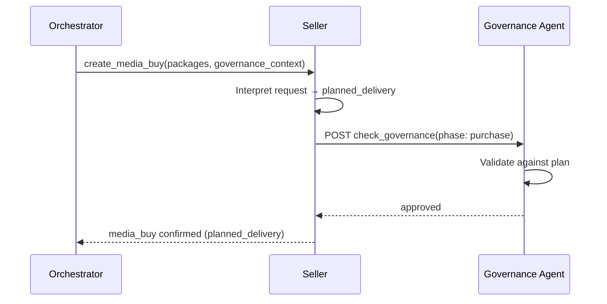
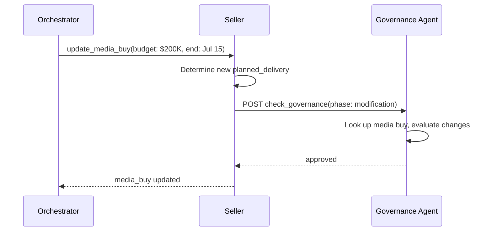
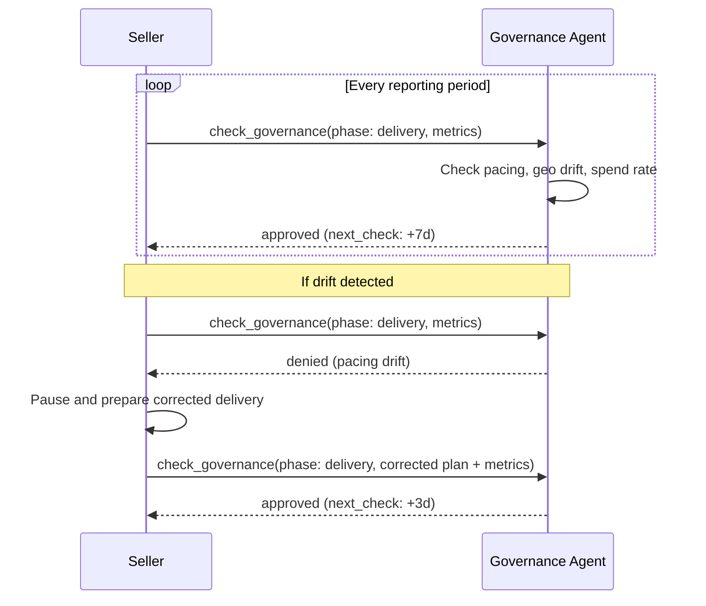
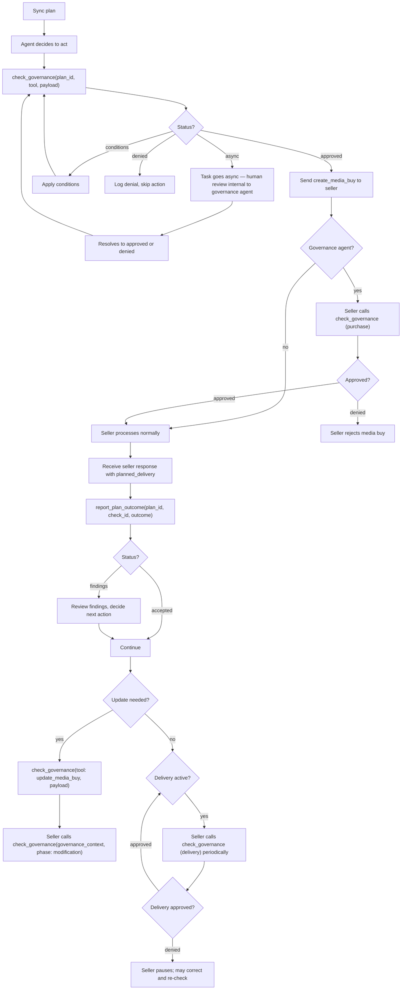

# Campaign Governance specification

<Note>
**Experimental.** Campaign governance is part of AdCP 3.0 as an experimental surface — it may change between 3.x releases with at least 6 weeks' notice. Sellers implementing it MUST declare `governance.campaign` in `experimental_features`. See [experimental status](/dist/docs/3.2.0-rc.4/reference/experimental-status) for the full contract.
</Note>

**Status**: Request for Comments
**Last Updated**: March 2026

The key words "MUST", "MUST NOT", "REQUIRED", "SHALL", "SHALL NOT", "SHOULD", "SHOULD NOT", "RECOMMENDED", "MAY", and "OPTIONAL" in this document are to be interpreted as described in [RFC 2119](https://www.rfc-editor.org/rfc/rfc2119).

This document defines the data models, validation logic, and integration patterns for Campaign Governance.

Campaign governance authorizes spending on behalf of the buyer; it does not make the buyer's governance agent a seller-side approver. See [sell-side governance boundaries](/dist/docs/3.2.0-rc.4/governance/sell-side-governance) for seller acceptance policies, proposal-bound change rights, typed seller dispositions, and seller-internal review.

## Campaign plan

The campaign plan is the source of truth for all validation. Plans are pushed to the governance agent via [`sync_plans`](/dist/docs/3.2.0-rc.4/governance/campaign/tasks/sync_plans) and define the plan parameters for a campaign -- budget limits, channels, flight dates, and plan markets. The governance agent resolves applicable policies from the brand's compliance configuration. Plans can also reference registry policies directly via `policy_ids` and include campaign-specific rules via `custom_policies`.

```json
{
  "plan_id": "plan_q1_2026_launch",
  "brand": {
    "domain": "acmecorp.com"
  },
  "objectives": "Drive awareness for spring product launch among 25-54 adults in the US, focusing on premium video and high-impact display.",
  "budget": {
    "total": 500000,
    "currency": "USD",
    "reallocation_threshold": 25000,
    "per_seller_max_pct": 40
  },
  "channels": {
    "required": ["olv"],
    "allowed": ["olv", "display", "ctv", "audio"],
    "mix_targets": {
      "olv": { "min_pct": 40, "max_pct": 70 },
      "display": { "min_pct": 10, "max_pct": 30 },
      "ctv": { "min_pct": 0, "max_pct": 20 },
      "audio": { "min_pct": 0, "max_pct": 10 }
    }
  },
  "flight": {
    "start": "2026-03-15T00:00:00Z",
    "end": "2026-06-15T00:00:00Z"
  },
  "countries": ["US"],
  "policy_ids": ["us_coppa", "alcohol_advertising"],
  "custom_policies": [
    {
      "policy_id": "no_competitor_adjacency",
      "enforcement": "must",
      "policy": "No advertising adjacent to competitor brand content."
    }
  ],
  "approved_sellers": null,
  "ext": {}
}
```

### Purchase types

Governance plans govern all financial commitments, not just media buys. The `purchase_type` field on `check_governance` identifies which kind of commitment is being validated:

| Purchase type | Tool | What's governed |
|--------------|------|-----------------|
| `media_buy` (default) | `create_media_buy`, `update_media_buy` | Media inventory purchases |
| `rights_license` | `acquire_rights`, `update_rights` | Brand rights licensing fees |
| `signal_activation` | `activate_signal` | Data signal activation fees |
| `creative_services` | `build_creative` | Creative generation fees |

All purchase types share the same governance loop: `sync_plans` → `check_governance` → execute → `report_plan_outcome`. The governance agent validates budget authority, geo compliance, and flight compliance across all types. Media-buy-specific validations (channel compliance, seller concentration, delivery pacing) apply only when `purchase_type` is `media_buy` or when the payload contains the relevant fields.

When `purchase_type` is omitted, the governance agent assumes `media_buy`.

<Note>
**Future purchase types**: Content standards, property list curation, and measurement/verification services (brand lift studies, viewability, fraud detection) all carry `pricing_options` in their schemas and bill through `report_usage`. These services currently lack an explicit activation tool where the buyer commits to the service — the billing relationship is implicit. When the protocol adds activation surfaces for these services, corresponding purchase types will be added to enable governance checks at the point of commitment.
</Note>

### Budget reallocation

`budget.reallocation_threshold` (required number) governs budget reallocation autonomy. It does not cover mandatory human review of decisions that affect data subjects — for that, see the plan-level `human_review_required` field.

| Value | Meaning |
|-------|---------|
| `0` | Every reallocation requires human approval |
| positive number below `budget.total` | Agent may reallocate up to this amount without escalation; larger moves escalate for human review |
| equal to `budget.total` (or greater) | Agent may reallocate freely within the plan's total budget |

### Budget allocations

Plans can optionally partition the total budget across purchase types using `allocations`:

```json
{
  "budget": {
    "total": 500000,
    "currency": "USD",
    "reallocation_threshold": 25000,
    "allocations": {
      "media_buy": { "amount": 400000 },
      "rights_license": { "amount": 75000 },
      "signal_activation": { "amount": 25000 }
    }
  }
}
```

When `allocations` is present, the governance agent validates spend against both the per-type allocation and the overall total. When absent, all spend counts against the single total regardless of purchase type. Allocations are guardrails, not hard partitions — the sum of allocations MAY differ from the total.

When `allocations` is present but a purchase type is not listed (e.g., `signal_activation` is attempted against a plan that only allocates for `media_buy` and `rights_license`), the governance agent validates the action against the plan's total budget only. Unlisted types are not denied — they draw from the shared pool. To restrict spending to listed types only, set `custom_policies` with explicit constraints.

### Human review required

`human_review_required` is a plan-level boolean (default `false`) that mandates human oversight of every action on the plan, independent of budget reallocation autonomy.

The governance agent sets `human_review_required: true` automatically when any resolved policy or policy_category on the plan carries `requires_human_review: true`. This includes regulated verticals such as `fair_housing`, `fair_lending`, `fair_employment`, and `pharmaceutical_advertising`, and the `eu_ai_act_annex_iii` policy covering decisions in Annex III use cases.

When `human_review_required` is true, the governance agent MUST escalate any action on the plan for human review before execution — regardless of the plan's `reallocation_threshold`. A permissive reallocation threshold does not bypass human review when the plan carries `human_review_required: true`; the two dimensions compose.

This field is distinct from `budget.reallocation_threshold`:

| Field | Scope | Purpose |
|-------|-------|---------|
| `budget.reallocation_threshold` | Operational | Controls agent autonomy for budget reallocation within the plan |
| `human_review_required` | Regulatory | Mandates human review of decisions affecting individuals (e.g., GDPR Art 22, EU AI Act Annex III) |

Callers MAY set `human_review_required: true` explicitly on a plan even when no triggering policy is present. Callers MUST NOT set it to `false` to override a policy that requires human review — the governance agent re-evaluates the flag from resolved policies on every sync and overrides a caller-supplied `false` when a triggering policy is present.

### Spend-commit invocation

Buyer-side governance invocation is enforceable, not advisory. When a governance agent is configured on the plan, the buyer agent MUST invoke [`check_governance`](/dist/docs/3.2.0-rc.4/governance/campaign/tasks/check_governance) before sending any spend-commit request to a seller — full stop — producing an **intent-phase** `governance_context` token to attach to that request. The governance agent decides internally whether to auto-approve, apply conditions, deny, or escalate to human review per the plan's `budget.reallocation_threshold` and `human_review_required` fields. No dollar figures, no baseline arithmetic, no operator-declared floors appear in the invocation rule — those auto-approve fast-paths belong inside the governance agent's own policy, not in the buyer's decision about whether to call at all.

#### Governed commitment operations

Request schemas use `x-governed-commitment` to declare whether every invocation commits (`scope: always`) or only commitment-increasing effects do (`scope: conditional`). Conditional annotations list both triggers and fail-safe exemptions. Cancellation, pause, deactivation, and decrease-only changes MUST remain available during a governance outage or denial; governance must not prevent risk-reducing cleanup.

For conditional tasks, services evaluate the **effective state delta**, not the presence of one request field in isolation. `trigger_overrides_exemption` is the mandatory precedence rule: an exemption applies only when the entire effective delta is risk-reducing or cost-free. If any part of a mixed request creates a trigger, the whole atomic request requires governance. Evaluation is task-specific:

- `update_media_buy`: load the current buy at the requested revision and compare the atomic result. Any higher committed budget, later end, resume, new package, or movement into materially different delivery is a trigger. Cancel, pause, or a pure decrease is exempt only when no triggering change is bundled.
- `accept_proposal`: accepting a new-buy proposal or a commitment-increasing amendment triggers governance. A negotiated cancellation or decrease-only amendment is exempt when it contains no triggering change, so cleanup remains available during an outage or denial.
- `control_media_buy`: compare the requested operational patch with the accepted proposal and authoritative current revision. A higher committed budget, resume, or delivery reallocation triggers governance. Cancel, pause, and decrease-only controls are exempt only when no triggering change is bundled; commercial changes outside the accepted envelope return `REQUOTE_REQUIRED` and proceed through proposal refinement.
- `update_rights`: load the current grant. Any higher price or cap, later end, resume, or pricing-option change is a trigger. Pause or a pure decrease is exempt only when no trigger is bundled.
- `activate_signal`: `activate` triggers; `deactivate` is exempt.
- `build_creative`: resolve the selected pricing option before execution. A positive vendor charge triggers; an estimate-only call or retrieval with zero vendor charge is exempt. If the service cannot establish zero cost before execution, it treats the request as triggering.

The strings in `triggers` and `exemptions` are stable audit labels, not JSON paths. Implementations use the algorithms above and MUST evaluate against authoritative current resource state in the same concurrency boundary as the eventual write.

The invocation requirement covers:

- [`create_media_buy`](/dist/docs/3.2.0-rc.4/media-buy/task-reference/create_media_buy) — committed budget across packages
- [`buy_products`](/dist/docs/3.2.0-rc.4/media-buy/task-reference/buy_products) — committed budget across canonical product purchases
- [`update_media_buy`](/dist/docs/3.2.0-rc.4/media-buy/task-reference/update_media_buy) — increases, extensions, resumptions, and reallocations; cancellation, pause, and decrease-only updates are exempt
- [`accept_proposal`](/dist/docs/3.2.0-rc.4/media-buy/task-reference/accept_proposal) — new commitments and commitment-increasing amendments; negotiated cancellations and decrease-only amendments are exempt
- [`control_media_buy`](/dist/docs/3.2.0-rc.4/media-buy/task-reference/control_media_buy) — commitment-increasing or reallocating controls; cancellation, pause, and decrease-only controls are exempt
- [`acquire_rights`](/dist/docs/3.2.0-rc.4/brand-protocol/tasks/acquire_rights) — rights pricing
- [`update_rights`](/dist/docs/3.2.0-rc.4/brand-protocol/tasks/update_rights) — increases, extensions, resumptions, and pricing changes; pause and decrease-only updates are exempt
- [`activate_signal`](/dist/docs/3.2.0-rc.4/signals/tasks/activate_signal) — activation only; deactivation is exempt
- [`build_creative`](/dist/docs/3.2.0-rc.4/creative/task-reference/build_creative) — executions that incur vendor cost; estimates and zero-cost retrieval are exempt
- Any future spend-commit task

When a task payload contains its numeric commitment directly, the governance agent evaluates that field. `update_media_buy` and `control_media_buy` are the important exceptions: the buyer computes the positive delta from its last confirmed revision and sends it as `proposed_commitment`; the governance agent treats that declaration as a ceiling and does not need access to seller-internal buy state. When a task identifies price only indirectly (for example a rights or signal `pricing_option_id`), the intent check likewise MUST include task-neutral `proposed_commitment: {amount, currency}`. Amount `0` is an explicit assertion that the resolved action is no-cost, not an omission. The intent separately names the exact downstream `target_agent`; that role-neutral routing field becomes the token audience and is not injected into the business payload. An approval signs the ceiling into `governance_context.authorized_commitment` and binds the exact task and business request with critical `authorized_task` and `authorized_payload_hash` claims. The payload hash is JCS/SHA-256 over the downstream task request excluding exactly the top-level governance/transport fields `governance_context` and `context`; `idempotency_key` and every business field remain bound. The downstream service recomputes that hash, compares its independently computed price or positive update delta and currency with the signed ceiling, and rejects any task, payload, amount, or currency mismatch. A governance agent that can resolve a pricing identifier itself MUST also reject a conflicting declaration. The approved ceiling is retained for outcome reconciliation; a lower report after execution cannot restore headroom.

Invocation is NOT required for discovery tasks, reporting tasks, operational-status tasks, or the explicit risk-reducing exemptions above. The MUST fires specifically when an operation creates, increases, extends, reallocates, or resumes an obligation.

When no governance agent is configured on the plan, `check_governance` invocation is neither required nor meaningful — there is nothing to call. Sellers MAY refuse to transact on plans lacking a configured governance agent as a matter of their own commercial policy (enterprise sellers typically will); the protocol does not mandate one, and the brand's published configuration is how a seller discovers whether one exists.

Orchestrators fanning out the same plan to multiple sellers produce one intent token per seller, because `aud` is bound byte-for-byte to the target seller. This is the correct protocol shape, but it means the governance agent sees the buyer's full shopping list on a plan. Operators who treat shopping intent as commercially sensitive SHOULD choose governance agents whose data-handling posture they trust.

#### Seller enforcement

A service receiving a governed commitment MUST require a valid, in-date **intent-phase** `governance_context` token on the request, verified per the [verification checklist](/dist/docs/3.2.0-rc.4/building/by-layer/L1/security#seller-verification-checklist). The token MUST carry `phase: "intent"` and be addressed (`aud`) to this service. The service does not need the buyer's `plan_id`: the opaque token is the authoritative plan binding, and the issuing governance agent recovers the plan from it. A request without a token, with a token that fails verification, or with a token issued for a different audience or phase MUST be rejected with `PERMISSION_DENIED`.

Applicability is resolved from the commercial account, not from token presence. A service advertising `governance_enforcement` for a task MUST be able to resolve that invocation to an account: from `account` on a create/activation/build/acquisition, or from the authoritative resource owner on an update. If neither is possible, it rejects with `ACCOUNT_REQUIRED` rather than guessing whether governance applies. Once resolved, a registered governance agent means the applicable commitment requires a token; no registered agent means the operation may proceed without one. A supplied token is always verified even when registration lookup says none. This conditional account requirement is part of the experimental capability claim even where a legacy request schema keeps `account` optional for 3.x compatibility.

For any task declared with `signed_context`, the service commits only after verifying the approved context. Media-buy tasks may additionally declare `online_execution_check`; those services follow **prepare → check → commit** by computing `planned_delivery` without externally committing it, calling `check_governance`, and committing atomically only after `approved`. Execution checks return `approved` or `denied`. Other roles do not claim online execution checking until AdCP defines a prepared-result contract for that role; they MUST NOT invent `planned_delivery` or `media_buy_id` values.

Identity is role-specific. On the buyer's intent check, `caller` is the authenticated buyer-side principal and is evaluated against `delegations`; `approved_sellers` is evaluated against the target service that becomes the token `aud`, never against that buyer. Every later execution check resolves that original intent by its opaque action binding before evaluating delegation—the immediately prior check's caller may be the seller. On an execution check, the authenticated `caller` MUST equal the audience preserved from the approved intent, and that seller identity is evaluated against `approved_sellers`. The execution commitment may narrow the approved intent but MUST use the same currency and MUST NOT exceed the intent's `authorized_commitment`. For `update_media_buy`, the seller computes `max(0, new committed total − authoritative current total)` atomically with its revision check and write, enforces the signed intent ceiling, and reports that value as `execution_commitment`; the governance agent never infers a delta by reading seller state or subtracting from the seller's post-update total. A buyer/seller delta mismatch fails closed and requires a fresh intent.

Sellers MUST persist the accepted intent token and any lifecycle tokens they subsequently hold, keyed at minimum by `jti` with `iss`, `aud`, the opaque action binding in `sub`, `phase`, decision outcome, and the timestamp of acceptance. They MUST NOT treat `sub` as a plan identifier. Retention follows the seller's regulatory retention period. Without seller-side retention, the audit log is single-sourced from the governance agent; independent reconciliation between seller records and `get_plan_audit_logs` is the cross-check that catches a compromised or misbehaving governance agent.

A buyer's successful `check_governance` does not obligate the seller to accept the request. Seller acceptance policy is an independent commercial and compliance layer; the seller's internal automation, review, and escalation process is not protocol authority and need not be exposed. Use `POLICY_VIOLATION` when seller content or advertising policy rejects an otherwise authorized action, `ACTION_NOT_ALLOWED` when a media-buy change is outside the accepted or currently available rights, and `PERMISSION_DENIED` only when the authenticated caller, account scope, credential, or signed governance context lacks authority.

When an authorized action fails after approval, the buyer reports the seller error through `report_plan_outcome` with `outcome: "failed"`. The governance agent retains that buyer-attributed error on the outcome audit entry. This closes the unexplained-audit gap without granting the seller a second approval role or claiming that the copied error is seller-authenticated evidence.

An approved token carries an `exp` that is authoritative at verification time; a policy change inside the token's validity window is accepted residual risk of any signed-decision system. Tight `exp` values (intent tokens SHOULD expire within 15 minutes per the JWS profile) bound the window rather than closing it. Operators who cannot tolerate the window MUST set `reallocation_threshold` to `0` or `human_review_required: true` so every action goes through an internal human review regardless of caching.

#### Audit logging

Every `check_governance` invocation MUST produce an audit log entry — retrievable via [`get_plan_audit_logs`](/dist/docs/3.2.0-rc.4/governance/campaign/tasks/get_plan_audit_logs) — capturing:

1. Invocation timestamp as a timezone-offset ISO 8601 string
2. Tool being validated (`create_media_buy`, `acquire_rights`, etc.) and commit amount in the plan's currency
3. Outcome (`approved`, `denied`, or `conditions`; and whether human review was invoked internally)
4. Human actor identity and authority, when a human signal was recorded
5. `check_id` for cross-reference from the downstream spend-commit task's audit entry and from `report_plan_outcome`

The buyer-side intent check and any seller-side execution check each produce a distinct `check_id`, while the opaque action binding in their signed `sub` remains stable. For completed or failed outcomes, `report_plan_outcome` MUST carry an exact `check_id`, `plan_id`, and `governance_context` tuple from an approved decision in that action lifecycle. The authenticated reporter MUST be the buyer-side caller from the original intent, and `purchase_type` MUST match that intent. The governance agent rejects mismatched tuples and permits only one terminal settlement per opaque action binding, regardless of whether a report names the intent or execution check (apart from an identical idempotent cached replay). Auditors reconcile that intent entry with any execution entry and the service's persisted token record. The report's monetary fields are reconciliation evidence: the governance agent derives ledger authority from its own intent record, narrowed by a matching purchase execution record when available.

#### Evidence authority and reconciliation

Campaign Governance is a three-party evidence system, not a rule that one participant is authoritative for every fact. The governance agent is selected by and works for the buyer, so its ledger is authoritative for authorization state but is not independent evidence that physical delivery or a refund occurred.

| Fact | Authoritative protocol record | What the other parties contribute |
|---|---|---|
| Spend authority and plan headroom | Governance agent's approved checks and derived ledger | Buyer proposes an action; seller may narrow the execution commitment |
| What the seller claims it delivered or billed | Seller-authenticated canonical delivery statement | Buyer may forward the copy it received or submit its own measurement |
| What the buyer observed | Buyer-authenticated delivery observation | It remains separately attributed and never overwrites the seller statement |
| Commercial release, refund, credit, or makegood | Seller report plus plan-owner review | Governance verifies identities, evidence integrity, bounds, and accounting policy |
| Current ledger and conservative exposure | Governance-derived state over all retained records | Neither a buyer nor seller can directly set this value |

For each `phase: "delivery"` check, the seller MUST provide an immutable `delivery_metrics.statement_id`, a monotonically increasing `sequence`, and a `statement_digest`. The digest is lowercase hex SHA-256 prefixed with `sha256:` over RFC 8785 JCS of:

```json
{
  "seller_reference": "<planned_delivery.media_buy_id>",
  "delivery_metrics": "<the complete delivery_metrics object except statement_digest>"
}
```

The seller's authenticated call attributes that statement to the seller. A statement ID is unique in that seller's namespace and binds to one governed action; reusing it for another action or different content is a conflict. A non-increasing sequence on the same action is also a conflict. Delivery evidence describes an already-authorized commitment and MUST NOT reserve that commitment a second time.

The buyer reports its side through `report_plan_outcome` with `outcome: "delivery"`, naming the exact seller delivery `check_id` and `governance_context`. `source: "seller_statement_copy"` means only that the buyer received the same seller statement; it is not independent corroboration. `source: "buyer_measurement"` is separately attributed buyer evidence. In either case, governance retains both records and compares period, cumulative spend, currency, and—when forwarded—the seller statement ID and digest.

How governance classifies a disagreement depends on the evidence source:

- **Forwarded copy with mismatched identity** — a `seller_statement_copy` whose statement ID or digest does not match the canonical statement means the seller told two different stories. Governance MUST mark the governed action `disputed` and preserve both records with their source identities.
- **Forwarded copy with matching identity but different values** — the statement digest covers the period, spend, and currency, so a copy whose digest matches the canonical statement cannot honestly carry different values. Governance MUST reject the observation as a validation error rather than record a dispute.
- **Buyer measurement variance** — a `buyer_measurement` with a matching period and currency but a different `cumulative_spend` is expected measurement noise, not evidence of equivocation. Governance MUST record it as `measurement_variance`, preserving both values with their source identities. The variance does not block adjustment acceptance; the conservative rules below price the difference instead.
- **Buyer measurement with a structural mismatch** — a period or currency that differs from the canonical statement makes the records incomparable. Governance MUST mark the governed action `disputed`.

Whenever the current seller-stated and buyer-observed amounts differ — `disputed` or `measurement_variance` — governance MUST:

- use `max(seller_reported_spend, buyer_observed_spend)` as `conservative_exposure`;
- compute the verified-decommitment ceiling from the conservative delivered figure, `max(latest seller-stated cumulative spend, latest buyer-observed cumulative spend)`;
- neither average the values nor choose the last writer; and
- reject adjustment acceptance while any reporting period for the governed action has a `disputed`, unclosed latest observation — not only the most recent reporting period. A `measurement_variance` observation never blocks acceptance.

The conservative ceiling is what makes manufactured variance pointless: a seller that understates its statement gains no extra decommitment room because the buyer's higher figure holds the ceiling down, and a buyer that inflates an observation only shrinks the headroom restorable to its own plan. A disagreement can freeze value; it can never free it.

Reconciliation is append-only. The buyer submits a newer observation against the applicable canonical seller statement after the parties resolve the discrepancy. The governance agent uses the latest observation as the current reconciliation state while retaining every earlier disputed record in the audit trail.

The governance agent evaluates every observation against the latest in-sequence canonical statement for that reporting period; an observation naming a superseded statement's check is rejected as a conflict rather than recorded against stale evidence.

A seller may also issue a corrected statement for the same open period by submitting a new `check_governance` delivery call with a higher `sequence`. The latest in-sequence statement becomes the applicable canonical statement; the buyer's next observation SHOULD bind to it. Earlier statements remain in the audit trail.

Campaign Governance is an operational control, not the source of truth for final billing. The authenticated plan owner MAY end an operational reporting window by submitting a new observation for that exact seller statement and period with `period_closed: true`. If the values still disagree — whether `disputed` or `measurement_variance` — governance records `closed_unresolved`, freezes both parties' evidence for that period, and stops the historical discrepancy from blocking later governance or a buyer-reviewed adjustment. Neither party may add a different delivery statement or observation for the closed period. Closure does not assert a final payable amount, settle an invoice, or resolve the commercial dispute; those remain outside Campaign Governance. A seller statement for a different subsequent reporting period starts that period as `open` and `unmatched`. A caller other than the authenticated plan owner cannot close a period: the governance agent MUST reject `period_closed: true` from any other authenticated reporter. Delivery observations themselves MAY be submitted by either the original intent caller or the plan owner.

Thus, a seller reporting 100 to governance and 200 to the buyer produces an explicit discrepancy, not an authoritative 100 or 200 overwrite. The converse behaves the same way. Governance's audit view exposes the current `delivery_reporting_period`, `seller_reported_spend`, `buyer_observed_spend`, `conservative_exposure`, `delivery_reconciliation_status`, and `delivery_period_state` while retaining every historical entry.

Commercial adjustments follow the same attributed-evidence rule. The authenticated seller first calls `report_plan_adjustment` with `action: "report"` and an integrity-bound evidence record. This creates a `reported` record only. The authenticated plan owner then calls the same task with `action: "review"` to accept or dispute the exact `adjustment_id`. A report becomes `verified` only after acceptance; a seller cannot unilaterally reduce net cost or restore plan headroom.

A buyer-disputed adjustment record is terminal: it cannot be re-reviewed, and it contributes nothing to net cost, headroom, or the cumulative-adjustment cap. The seller's only path to correct a disputed record is a new report carrying a new seller adjustment ID. Cumulative verified adjustments for an outcome MUST NOT exceed that outcome's authoritative commitment at acceptance time.

Verified decommitments require a canonical seller delivery statement and, in aggregate, cannot exceed the undelivered obligation, computed against the conservative delivered figure: `max(latest seller-stated cumulative spend, latest buyer-observed cumulative spend)`. Seller-issued adjustment and evidence IDs are immutable within the seller's namespace and cannot be rebound to different content. Verified refunds and credits reduce economic `net_cost`; they restore reusable headroom only when the plan explicitly uses `budget.accounting_mode: "verified_net_cost"`. The default `gross_commitment` mode restores headroom only for verified decommitments. Makegoods remain non-cash audit records in both modes. Regardless of mode, the original commitment remains in trailing anti-fragmentation aggregates, preventing repeated commit-adjust-commit cycles from evading cumulative thresholds.

#### Interaction with idempotency

- **Replay of an already-completed identical request within the seller's idempotency window:** return the cached outcome without re-executing side effects or re-authorizing. Token expiry after the original commit does not invalidate the historical cached success. This ordering is essential because the idempotency window is longer than the intent-token lifetime.
- **Retry that has no completed cache entry and would execute the state transition:** verify a fresh, unexpired `governance_context` and run the normal enforcement path. A repeated `jti` is accepted only when tied to the same in-flight `idempotency_key`; otherwise it is a replay attack.
- **Re-plan with a different payload (new `idempotency_key` per [Idempotency](/dist/docs/3.2.0-rc.4/building/by-layer/L1/security#idempotency)):** a fresh `check_governance` invocation is required. A new `governance_context` token is issued.

A retry after a human approval does not re-invoke governance; the existing token remains the authorization until it expires. Post-execution lifecycle retries operate against the seller's `purchase`-phase token, which is a distinct artifact governed by the seller's execution check, not the buyer's intent check.

### Channel mix targets

The `mix_targets` field defines acceptable allocation ranges. The governance agent validates that aggregate spend across all media buys stays within these ranges. A `create_media_buy` that would push video spend above 70% of total budget triggers a `conditions` or `denied` status.

### Delegations

Plans can include a `delegations` array that specifies which agents are authorized to execute against the plan and with what constraints. This makes the brand–agency delegation relationship explicit in the protocol.

```json
{
  "plan_id": "plan_q1_2026_launch",
  "brand": { "domain": "acmecorp.com" },
  "delegations": [
    {
      "agent_url": "https://buying.pinnacle-media.com",
      "authority": "full",
      "budget_limit": { "amount": 300000, "currency": "USD" },
      "markets": ["FR", "DE", "GB"],
      "expires_at": "2026-06-30T00:00:00Z"
    },
    {
      "agent_url": "https://buying.nova-agency.com",
      "authority": "execute_only",
      "markets": ["US"],
      "expires_at": "2026-06-30T00:00:00Z"
    }
  ]
}
```

Authority levels:

| Level | Meaning |
|-------|---------|
| `full` | Can execute any action within the delegation's budget and market constraints |
| `execute_only` | Can execute pre-approved actions but cannot initiate new campaigns or reallocate budget |
| `propose_only` | Can propose actions for governance review but cannot execute without explicit approval |

The governance agent resolves the authenticated transport credential to an agent URL and requires the request's `caller` assertion to match it. For a non-owner caller, it then compares that resolved URL with the delegation's `agent_url`. It MUST NOT authorize from the body assertion alone. Matching is exact and case-sensitive after normalization per RFC 3986. Every call fails closed when the credential has no agent-URL mapping. An agent requesting a media buy in France must have a delegation that includes France in its `markets`. An agent with `execute_only` authority cannot reallocate budget between channels.

The authenticated buyer principal that synchronized the plan is its owner and
always retains full authority. Delegations add explicitly scoped non-owner
agents; they do not replace or constrain the owner. When delegations are
absent, only that authenticated owner can initiate governed actions. A
self-asserted `caller` value never grants plan access.

<Note>
`delegations.authority` governs what a delegated executor-agent can do on behalf of the plan. It is unrelated to the plan's budget autonomy (`budget.reallocation_threshold` / `budget.reallocation_unlimited`) and unrelated to `plan.human_review_required`. Three separate concerns: per-agent scope, budget ops, and per-decision review.
</Note>


### Portfolio governance

For holding companies and multi-brand organizations, a plan can include a `portfolio` object that defines cross-brand constraints. Portfolio plans govern member plans -- any action validated against a member plan is also validated against the portfolio plan's constraints.

```json
{
  "plan_id": "portfolio_q1_2026_global",
  "brand": { "domain": "acmecorp.com" },
  "objectives": "Global Q1 media governance across all Acme brands",
  "budget": { "total": 50000000, "currency": "USD", "reallocation_threshold": 2000000 },
  "flight": { "start": "2026-01-01T00:00:00Z", "end": "2026-06-30T00:00:00Z" },
  "countries": ["US", "GB", "FR", "DE", "JP"],
  "portfolio": {
    "member_plan_ids": ["plan_sparkle_q1", "plan_glow_q1", "plan_nova_q1"],
    "total_budget_cap": { "amount": 50000000, "currency": "USD" },
    "shared_policy_ids": ["eu_gdpr_advertising", "eu_ai_act_article_50"],
    "shared_exclusions": [
      {
        "policy_id": "no_competitor_properties",
        "enforcement": "must",
        "policy": "No advertising on properties owned by competitor holding companies."
      }
    ]
  }
}
```

Portfolio constraints:

- **`total_budget_cap`**: Maximum aggregate spend across all member plans. The governance agent tracks committed budget across all member plans and denies actions that would exceed the cap.
- **`shared_policy_ids`**: Registry policies enforced across all member plans, regardless of individual brand compliance configuration. Corporate-level regulations that no brand team can override.
- **`shared_exclusions`**: Bespoke exclusion policies applied to all member plans, using the `PolicyEntry` shape. Additive only — same constraint as plan-level `custom_policies`.

The governance agent validates member plan actions against both the member plan's own constraints and the portfolio plan's constraints. A denial from either level blocks the action.

When a portfolio plan references a `member_plan_id` that the governance agent does not yet recognize, the governance agent SHOULD accept the portfolio plan and begin enforcing portfolio constraints as member plans are synced. This allows portfolio plans to be synced before their member plans without requiring a specific ordering.

<Note>
**Concurrency**: An orchestrator may send `create_media_buy` requests to multiple sellers simultaneously, each triggering a `committed` check. Budget checks are point-in-time and do not reserve budget, so concurrent approvals may together exceed the plan budget. The governance agent detects overspend at outcome reporting time. To prevent concurrent overspend, use [delegations](#delegations) with per-agent `budget_limit` to partition the budget across executing agents.
</Note>

### Aggregated-spend evaluation (fragmentation defense)

Governance thresholds (`reallocation_threshold`, `human_review_required` trigger points, registry-policy dollar floors) MUST be evaluated against **aggregated committed spend** over a trailing window, not per-plan or per-media-buy in isolation. A buyer that fragments a \$999,900 intended spend into 100 × \$9,999 buys — each individually below an operator's \$10,000 human-review threshold — would otherwise bypass review entirely. This is a fragmentation attack on governance, not a legitimate usage pattern, and the governance agent MUST close it.

Governance agents MUST aggregate committed spend across all of the following when evaluating any threshold:

- All plans attributable to the same `(buyer_agent, seller_agent, account_id)` tuple — fragmentation across plans on the same account does not reset the aggregate. Delegated sub-agents (see [Delegations](#delegations)) share the delegating buyer's aggregate: the `buyer_agent` element of the key is the delegating principal, not the sub-agent's `agent_url`. A delegation does NOT mint a fresh per-agent aggregation window, because otherwise the delegation surface itself reopens the fragmentation hole (\$999,900 split across 100 sub-agents, each getting their own \$9,999 budget).
- Every [spend-commit task](#spend-commit-tasks) — fragmentation across task surfaces does not reset the aggregate. The spend-commit task inventory is the single authoritative list; new spend-commit tasks added there join the aggregate automatically, without a separate edit in this section.
- The trailing window declared via the `governance.aggregation_window_days` capability (see [get_adcp_capabilities](#governance-aggregation-capability) below). The window slides with wall-clock time, not plan boundaries.

**Evaluation-time semantics (testable).** At the moment of a spend-commit, the governance agent computes

```
aggregate = sum(c.amount for c in commit_history
                where c.key == this.key
                  and c.ts > now - aggregation_window_days × 86400s)
            + this.amount
```

then evaluates `aggregate` against each applicable threshold. The current incoming commit is included in the sum. Denied commits and unresolved conditions do not contribute; only actions that ultimately receive `approved` and are confirmed count. `now` is the governance agent's wall-clock time at evaluation; sliding-window boundaries are not snapped to plan or calendar boundaries.

**Commitments are sticky within the window.** `c.amount` is the amount committed at approval time, not the delivered amount. Under-delivery, cancellation, makegoods, and post-approval budget reductions MUST NOT decrement a commit's contribution to the aggregate before the trailing window rolls it off. Otherwise a buyer could free fragmentation headroom by cancelling an approved commit and immediately re-committing sub-threshold — full spend moves across the round trip, each leg passes in isolation. An `update_media_buy` that *increases* committed budget enters as a delta (new committed budget − prior committed); a decrease does not decrement.

[`report_plan_adjustment`](./tasks/report_plan_adjustment) separates current plan obligation from that sticky history. A verified `decommitment` restores current plan headroom, but the original outcome amount remains in the trailing-window aggregate until it rolls off. Verified refunds and credits reduce economic net cost and restore headroom only under an explicit `verified_net_cost` accounting mode; makegoods never restore cash headroom. Governance agents MUST retain gross commitment, reported and verified adjustments, economic net cost, restored headroom, and current ledger commitment as separately auditable values.

When an individual commit would be below a threshold in isolation but pushes the trailing-window aggregate above the threshold, the governance agent MUST apply the threshold's consequence (human review escalation, denial, or conditions) to that commit. Governance agents MAY expose an `aggregate_committed` field on `get_plan_audit_logs` responses so auditors can reconstruct the fragmentation-defense decision without re-deriving it from the full outcome stream. The field's shape (units, currency, window-boundary reporting) is governance-agent-specific in 3.x and will be standardized in a later revision; implementers exposing it SHOULD document their shape alongside their `get_plan_audit_logs` response.

Governance agents MAY evaluate narrower aggregation scopes additionally (per-brand, per-campaign) but MUST NOT evaluate any scope *broader* than the declared window without operator sign-off. "Broader" covers **both** dimensions: a longer trailing window (time) and a wider key tuple (e.g., collapsing across `account_id` so two accounts share an aggregate). A silently-widened scope in either dimension is as surprising to the operator as a silently-narrowed one.

#### Composition with `reallocation_threshold`

A reallocation is itself a spend-commit: `update_media_buy` carries an incremental commit delta (new committed budget − previously committed), and that delta enters the aggregate and counts toward `reallocation_threshold` evaluation. A buyer cannot sidestep a \$25,000 reallocation threshold by fragmenting one \$30,000 reallocation into six \$4,999 updates — each update's delta accumulates into the trailing-window aggregate and trips the threshold once the cumulative delta crosses it.

#### Conformance example

Agent declares `aggregation_window_days: 30`. Plan sets a `human_review_required` trigger at \$10,000 committed spend (keyed on `(buyer_agent, seller_agent, account_id)`).

| # | Prior 30-day aggregate | Incoming commit | Post-aggregate | Expected outcome |
|---|-----------------------|-----------------|----------------|-------------------|
| 1 | \$4,000 | \$2,500 `create_media_buy` | \$6,500 | Auto-approve — below threshold |
| 2 | \$8,000 | \$2,500 `create_media_buy` | \$10,500 | Escalate to human review — aggregate crosses threshold even though the incoming commit is \$2,500 in isolation |

A governance agent that approves row 2 without escalation is non-conformant: it has either failed to aggregate across the 30-day window, failed to key on the correct tuple, or failed to include the incoming commit in the sum.

#### Governance aggregation capability

Sellers and governance agents declare their aggregation window via `governance.aggregation_window_days` in [`get_adcp_capabilities`](/dist/docs/3.2.0-rc.4/protocol/get_adcp_capabilities). Buyers that depend on a specific window for compliance (e.g., a brand-level weekly cadence review) MUST check this capability before relying on aggregation semantics — a governance agent declaring `aggregation_window_days: 7` does not defend against fragmentation spread across a 30-day quarter-end push. Absent declaration means the agent has not committed to any aggregation window and buyers MUST assume per-commit evaluation only (the fragmentation attack surface is open). There is no schema default: omission is not equivalent to a declared 30-day window.

## Brand compliance configuration

Compliance policies live at the brand level, not in individual campaign plans. The brand's policy team configures the brand's compliance profile, and the governance agent resolves it when processing plans for that brand.

<Note>
The schema and hosting mechanism for brand compliance configuration are under development by the AgenticAdvertising.org Governance Working Group. The following describes the conceptual model; implementations may vary.
</Note>

A brand's compliance configuration contains two kinds of policies:

- **Registry policies**: References to standardized policies in the [AdCP policy registry](/dist/docs/3.2.0-rc.4/governance/policy-registry), identified by ID. Each reference MAY include configuration parameters that customize the policy for the brand.
- **Custom policies**: Brand-specific rules expressed as natural language strings, evaluated by the governance agent using the same approach as [prompt-based policies](/dist/docs/3.2.0-rc.4/governance/overview#prompt-based-policies).

The policy team selects registry policies that apply to the brand, configures parameters where needed, and adds any custom policies specific to the brand. The buying team never interacts with this configuration -- they create campaign plans that reference the brand, and the governance agent resolves applicable policies automatically.

The brand's industries inform automatic policy matching -- for example, a brand in the beverage industry would receive any registry policies tagged for that industry.

## Policy registry

The policy registry is a community-maintained library of standardized, machine-readable advertising compliance policies. Brands reference policies by ID rather than writing their own.

The registry covers three categories:

| Category | Examples |
|----------|----------|
| **Jurisdiction** | UK HFSS restrictions, US COPPA, EU GDPR age-gating, California AI disclosure (SB 942) |
| **Vertical** | Alcohol age verification, pharma fair balance, gambling self-exclusion, financial services APR disclosure |
| **Brand safety** | Brand safety baselines, content suitability tiers |

Each policy in the registry has an ID, applicable jurisdictions, a description, and machine-readable rules that governance agents can evaluate programmatically. Policies are versioned as regulations change; brand references MAY pin a specific version, and unversioned references resolve to the current version. The registry format and hosting mechanism are under development by the AgenticAdvertising.org Governance Working Group.

This model follows the pattern established by [IEEE 7012](https://standards.ieee.org/ieee/7012/7192/) (Machine Readable Personal Privacy Terms), which maintains a neutral roster of standardized agreements that parties reference rather than draft individually.

## Policy resolution

Policies are declared directly on the plan via `policy_ids` and `custom_policies`. When a plan is synced, the governance agent resolves the active policy set:

1. Load registry policies referenced by `policy_ids`
2. Intersect with the plan's `countries` and `regions` -- only policies applicable to the plan's markets are active
3. Include all `custom_policies` (these apply regardless of geography)

<Warning>
**`custom_policies` are additive only.** Governance agents MUST pin registry-sourced policy text as system-level instructions and MUST NOT permit `custom_policies` (or the plan's `objectives` field) to relax, override, or disable registry-sourced policies. Custom policies may add tighter restrictions — they cannot lower enforcement levels or exempt categories. A `custom_policies` entry that contradicts a registry policy is evaluated alongside it, not instead of it; the stricter constraint governs.
</Warning>

The plan's `countries` and `regions` fields also serve as **geo enforcement**: the governance agent MUST reject governed actions targeting markets outside the plan's allowed geography. A plan with `regions: ["US-MA"]` rejects actions not explicitly targeting Massachusetts, even if they are otherwise compliant. These fields use the same ISO codes and semantics as `product-filters`, `offerings`, and `create_media_buy`.

The resolved policy set is what the governance agent evaluates during [`check_governance`](/dist/docs/3.2.0-rc.4/governance/campaign/tasks/check_governance). For the `brand_policy` and `regulatory_compliance` categories, the governance agent validates against this resolved set.

If the plan has no `policy_ids` or `custom_policies`, the governance agent operates with an empty policy set for policy-based categories. Other categories (`budget_authority`, `strategic_alignment`, etc.) still apply based on the plan's parameters.

## Audience governance

Campaign plans declare audience targeting constraints, restricted attributes, and policy categories. The governance agent uses these to validate that seller targeting complies with regulatory requirements and campaign intent.

### Three-layer model

Audience governance separates three concerns:

| Layer | Field | Purpose | Example |
|-------|-------|---------|---------|
| **Identity** | `brand.industries` | What the company does | `["pharmaceuticals", "consumer_packaged_goods"]` |
| **Regulatory regime** | `plan.policy_categories` | What regulations apply to this campaign | `["pharmaceutical_advertising", "health_wellness"]` |
| **Data restrictions** | `plan.restricted_attributes` | What personal data is off-limits for targeting | `["health_data"]` |

A pharmaceutical company is always pharma (identity), but a general awareness campaign might not trigger pharmaceutical advertising regulations (regime), and only campaigns in EU jurisdictions might restrict health data targeting (restrictions).

### Audience constraints

Plans can declare `audience.include` and `audience.exclude` arrays using audience selectors. Each selector is either a `signal_ref` or a natural language description.

The governance agent evaluates these constraints against seller targeting in `check_governance`:
1. Compare `planned_delivery.audience_targeting` against the plan's `audience.include`/`exclude`
2. Compare `planned_delivery.audience_targeting` against the same constraints (for committed checks)
3. Detect divergence between what the orchestrator requested and what the seller will activate

### Structural governance matching

Signal definitions can self-declare `restricted_attributes` and `policy_categories`. When they do, the governance agent performs **structural matching** — a set intersection between the plan's restrictions and the signal's declarations. This is deterministic and requires no LLM inference.

Direct media-buy demographic targeting is structural too: `targeting_overlay.demographics.age` maps to the `age` restricted attribute. A governance agent blocks that predicate only when the applicable plan includes `age` in `restricted_attributes`; the existence of the registry category is not a blanket prohibition on demographic targeting.

For signals without declared governance metadata, the governance agent falls back to **semantic matching** — inferring sensitivity from the signal name and description. Structural matching produces higher-confidence findings than semantic matching.

Restricted attributes apply to both `include` and `exclude` targeting. Using restricted data to exclude an audience (e.g., excluding people with health conditions from pharmaceutical ads) is as prohibited as using it for inclusion — both constitute use of restricted personal data for targeting decisions.

### Audience distribution drift

During delivery, sellers report `audience_distribution` in `delivery_metrics`. Index values indicate demographic composition relative to a declared baseline (census, platform, or custom). A value of 1.0 means parity; values significantly above or below indicate skew.

The governance agent tracks both per-period indices and cumulative indices across all reporting periods. This enables detection of systematic bias that might not be visible in any single reporting period.

## State tracking

The governance agent tracks state at two levels:

- **Plan level**: Total budget committed, channel allocation percentages, plan status
- **Campaign level**: Per-`governance_context` committed budget, active media buy references, validation history

A single plan can span multiple campaigns. When [`check_governance`](/dist/docs/3.2.0-rc.4/governance/campaign/tasks/check_governance) checks budget authority, it considers all campaigns tied to the plan. When [`report_plan_outcome`](/dist/docs/3.2.0-rc.4/governance/campaign/tasks/report_plan_outcome) settles an approval, the ledger uses the governance agent's own approved amount. A matching purchase execution check may narrow that amount to the seller's checked `planned_delivery.total_budget`; an unauthenticated buyer report cannot.

### Plan status

| Status | Meaning |
|--------|---------|
| `active` | Accepting validation requests and outcome reports |
| `suspended` | Paused pending human review of a critical escalation |
| `completed` | Plan finished; read-only |

When status is `suspended`, the governance agent MUST reject all `check_governance` and `report_plan_outcome` requests with a `CAMPAIGN_SUSPENDED` error until the escalation is resolved.

### Budget tracking

Budget is committed based on **confirmed outcomes**, not validated actions. The flow:

1. `check_governance` with `tool` + `payload` (intent check) checks whether the proposed spend fits within the plan. No budget is committed yet.
2. The orchestrator executes the action with the seller.
3. `report_plan_outcome` settles the exact approved check. The governance agent commits its own authorized amount, preferring the matching purchase execution check when present, and records the caller-reported seller amount only as reconciliation evidence.

This prevents a compromised or mistaken orchestrator from restoring headroom by under-reporting. If a seller reduces a \$150K intent to \$120K, its pre-commit purchase execution check makes \$120K authoritative. Without that checked transition, governance conservatively reserves \$150K and records the \$120K report as a discrepancy. If the action fails, the governance agent commits \$0.

An execution check approval validates the seller's planned delivery against the plan but does not commit budget. Budget is only committed when the orchestrator calls `report_plan_outcome` with the seller's confirmed response.

Budget checks are point-in-time: `check_governance` validates against the current committed total but does not reserve budget. If multiple agents execute concurrently against the same plan, two checks could both pass and the combined outcomes could exceed the authorized budget. The governance agent detects overspend at outcome reporting time and returns a `budget_authority` finding. To prevent concurrent overspend, use [delegations](#delegations) with per-agent `budget_limit` to partition the budget across executing agents.

### Drift detection

The audit log includes `drift_metrics` that surface aggregate governance trends over the plan's lifetime:

```json
{
  "summary": {
    "checks_performed": 847,
    "drift_metrics": {
      "human_review_rate": 0.03,
      "human_review_rate_trend": "declining",
      "auto_approval_rate": 0.91,
      "human_override_rate": 0.02,
      "mean_confidence": 0.88
    }
  }
}
```

These metrics detect oversight drift -- the gradual migration of control away from humans. A declining human review rate may indicate the governance agent is well-calibrated, or it may indicate that oversight is eroding. Surfacing the trend lets the organization make that judgment.

| Metric | What it measures |
|--------|-----------------|
| `human_review_rate` | Fraction of checks that required internal human review |
| `human_review_rate_trend` | Direction over the plan's lifetime (`increasing`, `stable`, `declining`) |
| `auto_approval_rate` | Fraction of checks approved without human intervention |
| `human_override_rate` | Fraction of human reviews where the human overrode the governance agent |
| `mean_confidence` | Average confidence score across findings (when confidence is reported) |

Organizations can set thresholds on drift metrics. When a metric crosses its threshold, the governance agent SHOULD include a finding (severity `warning`) on the next governance check:

```json
{
  "drift_metrics": {
    "human_review_rate": 0.01,
    "human_review_rate_trend": "declining",
    "auto_approval_rate": 0.97,
    "thresholds": {
      "human_review_rate_min": 0.02,
      "auto_approval_rate_max": 0.95
    }
  }
}
```

In this example, both thresholds are breached -- the human review rate (0.01) is below the minimum (0.02) and the auto-approval rate (0.97) exceeds the maximum (0.95). This could indicate that the governance agent is approving too broadly, or that policies are well-calibrated for a low-risk campaign. The threshold breach surfaces the question; the organization decides the answer.

Organizations set only the thresholds relevant to their concern. A `human_review_rate_min` catches oversight erosion; a `human_review_rate_max` catches policy miscalibration. A `human_override_rate_max` catches a governance agent whose recommendations are consistently wrong. All threshold fields are optional.

### Plan amendments

Calling `sync_plans` with an existing `plan_id` updates the plan (upsert). The governance agent increments `plan_version` and applies the new parameters immediately. Active media buys that were approved under the previous plan version are not automatically re-validated -- the governance agent evaluates them against the updated plan on the next `check_governance` call (e.g., the next delivery check). If an amendment reduces the budget below the currently committed amount, the governance agent flags this as a finding on the next governance check.

## Validation logic

For intent checks, the governance agent evaluates each [validation category](/dist/docs/3.2.0-rc.4/governance/campaign/index#validation-categories) independently:

- If **any** category has status `failed` and the failure is correctable, the status is `conditions` with suggested fixes
- If **any** category has status `failed` and the failure is not correctable by the caller, the status is `denied`
- If all categories pass but the overall risk profile warrants human review, the governance agent handles the review internally (the task goes async) and eventually resolves to `approved` or `denied`
- If all categories pass, the status is `approved`

The `conditions` array is only present when the status is `conditions`. Each condition identifies a specific field, its current value, a suggested value, and the reason for the change.

For execution and lifecycle checks, any failed category produces `denied`. Findings may explain a correctable failure, but the service has no authorization until it submits a new candidate and receives `approved`.

### Finding confidence

Governance findings include an optional `confidence` score (0-1) and `uncertainty_reason` that distinguish certain violations from ambiguous ones:

```json
{
  "category_id": "regulatory_compliance",
  "severity": "critical",
  "confidence": 0.85,
  "uncertainty_reason": "Targeting includes 'New Mexico' which partially overlaps LATAM HFSS jurisdiction boundaries",
  "explanation": "Potential HFSS jurisdiction violation based on targeting geography."
}
```

Confidence informs the appropriate response:
- **High confidence (0.9+)**: The finding is definitive. A GDPR violation on a campaign explicitly targeting EU users.
- **Medium confidence (0.6-0.9)**: The finding depends on context the governance agent cannot fully resolve. Audience segments that may include minors, geo targeting that partially overlaps regulated jurisdictions.
- **Low confidence (below 0.6)**: The finding is speculative. The governance agent flags it for human review rather than acting on it autonomously.

Without confidence, every finding is presented as equally certain, which either over-blocks (if treated as certain) or trains people to ignore findings (if many are false positives). Governance agents SHOULD include confidence when the evaluation involves natural language interpretation or probabilistic matching.

### Phase inference

The governance agent determines the token phase from the request shape, not from
the tool name or a caller-supplied lifecycle phase:

- `tool` + `payload` is an orchestrator-side intent check. Its signed
  `governance_context` carries `phase: "intent"` and omits `media_buy_id`, even
  when the proposed payload contains a media buy ID or the caller supplies a
  lifecycle `phase`.
- `planned_delivery` is a seller-side execution check (normally carrying the
  buyer's prior `governance_context` for lifecycle continuity).
  Its signed token carries the requested `purchase`, `modification`, or
  `delivery` phase (defaulting to `purchase`) and binds to the seller-assigned
  `media_buy_id` when one is supplied.

This separation prevents a proposed action from being mistaken for a seller's
authorization to execute it. The `phase` request field applies only to execution
checks; it does not override an intent-shaped request.

The `check_id` returned by `check_governance` is used by `report_plan_outcome` to link the seller's response back to the validated action.

## Capability declaration

Governance agents declare their Campaign Governance support in `get_adcp_capabilities`:

```json
{
  "adcp": {
    "attestations": {
      "accepted_claim_types": [
        "https://claims.example/audience/population-stability"
      ],
      "accepted_proof_formats": [
        "https://formats.example/jcs-signed-json"
      ],
      "supported_delivery_methods": [
        "credential_uri",
        "issuer_credential_id",
        "embedded"
      ],
      "accepted_issuers": [
        {
          "issuer": {
            "type": "origin",
            "origin": "https://credentials.example"
          },
          "credential_origins": [
            "https://credentials.example"
          ],
          "resolvers": [
            {
              "resolver_id": "primary",
              "url": "https://resolver.credentials.example/v1/credentials",
              "authentication": "evaluator_managed"
            }
          ]
        }
      ]
    }
  },
  "governance": {
    "runtime_attestations": {
      "signal_activation": {
        "requirement": "required",
        "claim_types": [
          "https://claims.example/audience/population-stability"
        ]
      }
    },
    "campaign_governance": {
      "categories": [
        {
          "category_id": "budget_authority",
          "description": "Validates spend against plan budget limits and allocation rules."
        },
        {
          "category_id": "strategic_alignment",
          "description": "Validates that purchases match campaign brief and channel mix targets."
        },
        {
          "category_id": "bias_fairness",
          "description": "Checks targeting for discriminatory patterns and protected category compliance.",
          "jurisdictions": ["US", "EU", "UK"]
        },
        {
          "category_id": "regulatory_compliance",
          "description": "Validates jurisdiction-specific advertising regulations.",
          "jurisdictions": ["US", "EU", "UK"]
        },
        {
          "category_id": "seller_verification",
          "description": "Compares seller setup against original requests to detect discrepancies."
        },
        {
          "category_id": "brand_policy",
          "description": "Enforces brand-level compliance policies resolved from the brand configuration and policy registry."
        }
      ]
    }
  }
}
```

`adcp.attestations` is the shared portable-attestation trust and delivery allowlist. `governance.runtime_attestations` is the action-specific policy: presence enables `check_governance.runtime_attestations[]` for signal activation, `requirement` controls whether omission is allowed, and `claim_types` MUST be a subset of the shared accepted claims. Governance capabilities do not duplicate resolver URLs or verifier trust; those remain centralized in the shared block.

### Runtime signal-quality evaluation

`runtime_attestations[]` is standardized per-check evidence for `purchase_type: signal_activation` when `tool` is `activate_signal` and `payload.action` is `activate` or omitted (the default). It MUST NOT be supplied for `payload.action: deactivate`, and a `requirement: required` policy applies only to activation: missing evidence MUST NOT block deactivation. The evidence is outside the campaign plan: it neither changes declared plan intent nor provides delegation authority. Plan-level `delegations[]` remains the only delegation-continuity mechanism.

AdCP does not define a credential issuance API or an orchestrator-side discovery/retrieval API for attestation references. The orchestrator obtains references through an issuer-defined or other out-of-band mechanism before calling `check_governance`. Once presented, evaluator-side credential resolution follows the shared portable-attestation contract and the governance agent's published allowlist.

For each presentation, the governance agent applies the shared [portable-attestation procedure](/dist/docs/3.2.0-rc.4/building/by-layer/L1/security#portable-attestations), then checks the complete typed subject against the governed signal and action. For `activate_signal`, `subject.id` matches `payload.signal_agent_segment_id`; `subject.namespace` and any richer signal identity are reconciled with the signals agent and plan state known to the governance agent. A matching opaque id under a different namespace is a subject mismatch.

The response carries exactly one ordered `runtime_attestation_evaluations[]` result per presentation. Evaluation `outcome`, `confidence`, and `reason_codes` are produced by the governance agent; they are never authoritative buyer input. Every evaluation binds to the current `check_id` through `action_binding`.

The governance agent also computes:

```text
attestation_bound_findings = findings filtered to entries with attestation_reference_digest
runtime_attestation_binding_digest =
  "sha256:" + lowercase_hex(SHA-256(JCS({
    evaluations: runtime_attestation_evaluations,
    findings: attestation_bound_findings
  })))
```

Array order is preserved. Omitted optional fields remain omitted; implementations MUST NOT synthesize defaults before JCS canonicalization. The response, signed `governance_context`, and `get_plan_audit_logs` check entry carry the identical digest. Audit logs retain ordered `{ reference, evaluation }` pairs and the complete attestation-bound findings. Auditors MUST first verify that each evaluation's `reference_digest` equals SHA-256 of RFC 8785 JCS over its paired reference, then recompute the binding digest from the ordered evaluations and findings.

## Integration with `create_media_buy`

The buyer includes `governance_context` on the protocol envelope. It does not disclose `plan_id` to the seller; the context carries the opaque, signed binding needed for seller-side verification and for the governance agent to recover the plan.

```json
{
  "tool": "create_media_buy",
  "arguments": {
    "account": { "agent_url": "https://seller.example.com", "id": "acc_123" },
    "brand": { "domain": "acmecorp.com" },
    "start_time": "2026-03-15T00:00:00Z",
    "end_time": "2026-06-15T00:00:00Z",
    "packages": ["..."]
  }
}
```

The seller's response includes `planned_delivery` -- what the seller will actually run:

```json
{
  "seller_reference": "mb_seller_456",
  "packages": ["..."],
  "planned_delivery": {
    "geo": { "countries": ["US"] },
    "channels": ["olv"],
    "start_time": "2026-03-15T00:00:00Z",
    "end_time": "2026-06-15T00:00:00Z",
    "total_budget": 150000,
    "currency": "USD",
    "frequency_cap": { "max_impressions": 3, "per": "user", "window": { "interval": 1, "unit": "days" } },
    "audience_summary": "Adults 25-54, US, premium video inventory",
    "enforced_policies": ["us_coppa"]
  }
}
```

`planned_delivery` is the seller's interpretation of the request -- the actual delivery parameters they will use. It serves two purposes:

1. **Governance checks** -- When the account has a governance agent configured, the seller sends `planned_delivery` to the governance agent for verification before confirming the media buy.
2. **Transparency** -- The buyer can compare `planned_delivery` against what they requested to catch discrepancies early, before delivery begins.

## Media-buy online execution checks

Campaign Governance's buyer-side validation has a trust limitation: the buyer's orchestrator grades its own homework. An LLM agent could hallucinate governance approval, skip validation, or misrepresent what was validated. Seller-side governance checks close this gap by giving sellers an independent way to confirm that purchases are approved.

The seller POSTs to the buyer's configured governance agent URL when governed action events occur. The governance agent maintains all state and correlates subsequent requests from `governance_context`; the seller does not need the plan ID or governance history.

### Both checks must pass

Every media-buy task whose capability entry includes `online_execution_check` **MUST** pass both the buyer-side intent check and the seller-side planned-delivery check. Both calls hit the same authority (the buyer's governance agent), so there is no "two agents disagreeing" case — but the invariant that both calls must succeed is load-bearing:

- The buyer-side intent check confirms the *plan permits the spend in principle*.
- The seller-side planned-delivery check confirms the *seller's actual delivery parameters are consistent with the approved plan*.

These are not redundant. A buyer's intent check can pass (the plan allows $100K on premium video) while the seller's planned-delivery check fails (the seller's planned line-up includes inventory the plan excludes). Intent checks may return `conditions` as a counterproposal; the buyer applies them and re-checks. Execution checks are binary. If the concrete candidate is not allowed, the governance agent returns `denied` and the action **MUST NOT** proceed.

A seller that rejects a trade for its own content-standards or commercial reasons is not participating in a governance conflict — that is a separate, commerce-layer rejection (e.g., `TERMS_REJECTED`) and follows the regular rejection path. Governance speaks only for the buyer's plan.

### Setup

The buyer syncs governance agents via [`sync_governance`](/dist/docs/3.2.0-rc.4/accounts/tasks/sync_governance), pairing each account with the governance agent endpoints to call. Each agent includes authentication credentials so the governance agent can verify the seller's identity:

```json
{
  "tool": "sync_governance",
  "arguments": {
    "accounts": [
      {
        "account": {
          "brand": { "domain": "acmecorp.com" },
          "operator": "pinnacle-media.com"
        },
        "governance_agents": [
          {
            "url": "https://governance.pinnacle-media.com",
            "authentication": {
              "schemes": ["Bearer"],
              "credentials": "gov_token_acme_pinnacle_2026_xyzxyzxyz..."
            }
          }
        ]
      }
    ]
  }
}
```

The seller stores these endpoints and presents the credentials when calling `check_governance`. The governance agent MUST resolve the credential to the registered agent URL, require exact equality with `caller`, and use only the resolved URL for authorization, audit, and token issuance. It rejects unrecognized credentials, caller mismatches, and restricted-plan calls whose credential lacks an agent-URL mapping.

### Governance modes

Governance mode (audit, advisory, enforce) is an internal implementation detail of the governance agent, not a protocol-level field. The caller sends `check_governance` and acts on the verdict without needing to know what mode produced it. Intent checks may return `approved`, `denied`, or `conditions`; execution checks return `approved` or `denied`.

This means:
- A governance agent in audit mode internally always returns `approved` with findings attached
- A governance agent in advisory mode returns `approved` with prominent findings and recommended corrections
- A governance agent in enforce mode returns `denied` and expects the caller to stop

Mode is configured by the buyer's policy team on the governance agent itself, not via the protocol. The governance agent MAY include mode information in its audit logs or `get_plan_audit_logs` response for post-hoc analysis, but callers MUST NOT branch behavior based on mode — they act on the status they receive.

See the [safety model](/dist/docs/3.2.0-rc.4/governance/campaign/safety-model) for the crawl-walk-run adoption path.

### Governance context

The `governance_context` field is an opaque string issued by the governance agent in the `check_governance` response. It correlates any governed action's lifecycle and is the primary audit/reporting key. The governance agent encodes whatever internal state it needs (plan reference, budget snapshot, check history) into this value.

Callers MUST NOT interpret `governance_context`. They persist and forward it:

- **Buyer**: receives `governance_context` from `check_governance` response, attaches it to the protocol envelope when sending the media buy to the seller.
- **Seller**: receives `governance_context` in the envelope, stores it alongside the media buy, and includes it on all subsequent `check_governance` calls for that media buy's lifecycle.
- **Governance agent**: uses `governance_context` to reconnect each lifecycle event to the original plan, campaign grouping, and budget state.

On the first `check_governance` call (before any context exists), the governance agent extracts what it needs from `payload` and `plan_id`. On subsequent calls, `governance_context` provides the continuity so the governance agent does not need to re-derive state from the payload.

Governance agents SHOULD treat `governance_context` as a lookup key into server-side state or a signed token, not as a plain-text encoding of governance state. If state is encoded directly, it MUST be signed (e.g., HMAC) so tampering by intermediaries is detectable.

In AdCP 3.0 the encoded value is a compact JWS signed per the [AdCP JWS profile](/dist/docs/3.2.0-rc.4/building/by-layer/L1/security#adcp-jws-profile). The token carries a required `plan_hash` claim that binds the attestation to the exact plan state the governance agent evaluated (see [Plan binding and audit](#plan-binding-and-audit) below). Callers still treat the value as opaque for correlation; sellers that opt into verification follow the [seller verification checklist](/dist/docs/3.2.0-rc.4/building/by-layer/L1/security#seller-verification-checklist), which verifies the token's authenticity, authorization scope, and freshness — not the buyer's plan.

### Plan binding and audit

The `plan_hash` claim is the cryptographic receipt that forever binds a signed `governance_context` attestation to the exact plan state the governance agent evaluated. It is an **audit-layer** property — sellers do not verify it and are not expected to. The buyer's plan carries commercially sensitive data (cross-seller allocations, per-seller caps, objectives, `approved_sellers` lists, custom policies, `ext`) that buyers do not share with sellers; there is no plan-retrieval mechanism in 3.x and none is planned. `plan_hash` rides inside the JWS because the JWS is already the signed artifact the governance agent produces, but it is not part of the wire-verification contract.

What the claim delivers:

- **Post-hoc accountability.** Every governance attestation is forever-bindable to the plan state it attested to. Regulators and forensic audits can prove "this transaction was authorized under plan state X at time T" years after the fact, using only the retained JWS and the governance agent's revision records.
- **Governance-agent self-integrity.** On every `check_governance` call, the governance agent re-evaluates current plan state and re-hashes. Tampering with the governance agent's persisted plan between calls surfaces as a mismatch against the retained revision record.
- **Buyer-side compliance verification.** A buyer's own tooling can verify its governance agent is producing tokens that match the plan the buyer actually pushed — catching a compromised or misbehaving governance vendor.

#### Canonicalization

`plan_hash = base64url_no_pad(SHA-256(JCS(plan_payload)))` where:

- `JCS` is [RFC 8785 JSON Canonicalization Scheme](https://www.rfc-editor.org/rfc/rfc8785) — the same scheme used for [idempotency payload equivalence](/dist/docs/3.2.0-rc.4/building/by-layer/L1/security#payload-equivalence). Governance agents and auditor verifiers SHOULD use the same library implementations listed there. JCS sorts object keys lexicographically by code point (caller key order in the `sync_plans` request does not affect the hash) and preserves the distinction between an omitted optional field and an explicit `null` (these produce different hashes). Governance agents MUST hash the plan as-supplied; they MUST NOT synthesize omitted optionals to default values and MUST NOT drop explicit nulls.
- `plan_payload` is **one element of the `plans[]` array as supplied on `sync_plans`** — a single plan object, not the `sync_plans` request envelope and not the `plans` wrapper array. The preimage is the current plan-revision state at the time of attestation, i.e., the plan object the governance agent just evaluated. Implementations constructing the preimage start from the plan-revision object and remove the closed set of bookkeeping fields listed below.
- `base64url_no_pad` follows RFC 4648 §5 with trailing `=` padding stripped — consistent with `jti` and other base64url values in the JWS profile. Governance agents MUST emit the unpadded form. Verifiers (governance agents re-verifying their own tokens, auditors, buyer-side compliance tooling) MUST compare by base64url-decoding both sides to the raw 32-byte SHA-256 digest and comparing bytes — NOT by string equality of the encoded form — so padding, case, or alphabet variation is rejected as a decode failure rather than producing a false non-match. A `plan_hash` that does not decode to exactly 32 bytes MUST be rejected.

#### Excluded fields

Closed list — governance agents MUST NOT extend or shrink it; any addition is a breaking change requiring a profile version bump, same rule as [Payload equivalence](/dist/docs/3.2.0-rc.4/building/by-layer/L1/security#payload-equivalence):

- `version` — governance-agent revision counter, set by the agent on each re-sync
- `status` — plan lifecycle status managed by the agent
- `syncedAt` — timestamp written on each re-sync
- `revisionHistory` — agent-internal append-only revision log (MUST be append-only archival; implementations MUST NOT read revisionHistory entries back into the active plan-object shape used for hashing)
- `committedBudget` — derived from downstream `check_governance` / `report_plan_outcome` activity
- `committedByType` — derived from the same activity

None of these appear in the `sync_plans` request schema (`additionalProperties: false` on the plan item); they exist only on the governance agent's persisted plan state. The list is stated explicitly so an implementer naively hashing their internal state struct strips the right fields. Implementations that discover additional GA-internal fields on their persisted plan state beyond this list MUST treat those fields as **IN the preimage** until the profile version bumps — fail-safe toward inclusion, not exclusion. The "anything that looks like bookkeeping → strip" shortcut silently diverges every implementation that guesses differently; the safe default is "if it is not on the closed list, it is part of the hash."

All other fields — including `ext`, `custom_policies`, `objectives`, `delegations`, `human_override`, and every field declared in the `sync_plans` plan-item schema — are IN the preimage. Caller guidance:

`check_governance.runtime_attestations[]` is not a plan field and is therefore outside this preimage. Its omission or change does not alter `plan_hash`; the separate `runtime_attestation_binding_digest` binds that per-check evidence and evaluation to the signed governance decision.

- **`ext` is part of the preimage.** Buyers MUST NOT place rotating tokens or retry-unstable values inside `ext` on a plan; a value that changes between re-syncs invalidates every outstanding governance_context token for the plan even when the buyer's declared intent is unchanged (consistent with idempotency's treatment of `ext`).
- **`delegations[].expires_at`** is declared intent and SHOULD be stable across re-syncs of the same plan; regenerating it from "now + N days" on every sync causes hash churn.
- **Array order** in `policy_ids`, `policy_categories`, `custom_policies`, `approved_sellers`, `delegations`, `countries`, `regions`, `channels.required`, `channels.allowed` is not semantically meaningful, but JCS preserves it. Buyers SHOULD emit these in stable order across re-syncs.
- **JCS does not Unicode-normalize.** Per RFC 8785 §3.2.5, JCS preserves strings as-supplied — visually-indistinguishable Unicode variants (Latin `a` vs Cyrillic `а`, NFC-vs-NFD compositions, confusable homoglyphs) produce distinct bytes and therefore distinct hashes. `plan_hash` detects this divergence correctly at the cryptographic layer, but the plan-semantics layer does not: two plans whose `policy_ids` or `policy_categories` differ only by a homoglyph substitution authorize different enforcement outcomes at the governance agent and at downstream consumers. Buyers and governance agents SHOULD validate `policy_ids` and `policy_categories` against a canonical allowlist server-side before emitting or evaluating them. This is a plan-content rule, not a hashing rule — `plan_hash` integrity is intact either way; the allowlist is what prevents a homograph substitution from producing a different authorization decision.

#### Governance-agent obligations

Governance agents MUST:

- Compute `plan_hash` over the current plan state on every `check_governance` call and include it in the signed JWS payload. The hash MUST be over the plan the agent just evaluated; stale attestations over mutated plans MUST NOT be produced.
- Refresh the signature on every `check_governance` invocation — fresh `jti`, `iat`, `exp`, and `plan_hash`. Governance agents MUST NOT cache and re-emit a previously-signed `governance_context` token across plan revisions. Envelope idempotency response caching is a separate regime — `governance_context` is on the closed exclusion list in [Payload equivalence](/dist/docs/3.2.0-rc.4/building/by-layer/L1/security#payload-equivalence) precisely so it can rotate on replay.
- **Retain the per-revision `plan_hash`** alongside each internal plan-revision record — MUST, regardless of whether `audit_log_pointer` is exposed. Retention is what delivers the forever-binding property; without universal retention, every governance agent that doesn't use `audit_log_pointer` silently voids the audit layer for its entire token corpus. An audit log that cannot be joined back to the attested plan state is half an audit trail, and a governance agent that cannot verify its own historical tokens cannot detect tampering of its own store. Retained values are implementation-internal and are never exposed on the wire except through the normalized response on [`get_plan_audit_logs`](/dist/docs/3.2.0-rc.4/governance/campaign/tasks/get_plan_audit_logs), which echoes `plan_hash` per entry so auditors do not have to reconstruct from the governance agent's private records.

#### Wire-verification contract

`plan_hash` is not listed in `crit`. `crit` is wire-verifier semantics (RFC 7515 §4.1.11): it forces verifiers to reject tokens whose listed claims they cannot process. No wire verifier processes `plan_hash` — the only parties who can fetch the preimage (governance agent, auditor, buyer compliance) are off-wire. Listing in `crit` would force sellers to reject tokens they have no basis to verify, with no offsetting benefit. Governance agents MUST emit the claim and MUST NOT list it in `crit`.

Sellers persist and forward `governance_context` verbatim and perform the [15-step JWS verification checklist](/dist/docs/3.2.0-rc.4/building/by-layer/L1/security#seller-verification-checklist) — authenticity, authorization scope, freshness. They treat `plan_hash` as opaque cargo inside the token and never inspect it.

#### Verification recipes

**Auditor recipe.** A regulator or third-party auditor with access to a plan's audit logs verifies historical attestations as follows:

1. Call [`get_plan_audit_logs`](/dist/docs/3.2.0-rc.4/governance/campaign/tasks/get_plan_audit_logs) with `include_entries: true` to retrieve the audit trail. Each `check` entry carries `plan_hash` (the claim asserted at issuance time) and `governance_context` (the signed JWS).
2. For each governance_context, decode the compact JWS and verify the 15-step JWS contract (signature, `iss` in brand.json, `aud`, `exp`, etc.) against the governance agent's published JWKS.
3. Extract the `plan_hash` claim from the decoded JWS payload and base64url-decode to 32 raw bytes.
4. Decode the entry-level `plan_hash` to 32 raw bytes and byte-compare to the claim. A mismatch means the retained audit record disagrees with the signed token — either the token was tampered with or the record was, and the governance agent's integrity is in question.
5. Optionally: recompute `plan_hash` from the governance agent's retained per-revision plan record (if the auditor has authenticated access to the governance agent's revision store) and byte-compare again. A mismatch here means the governance agent's own store was tampered with between signing and audit.

**Buyer-side compliance recipe.** A buyer whose own tooling wants to verify its governance agent is producing honest tokens:

1. Observe `governance_context` tokens flowing through the protocol envelope to sellers (the buyer already has these; no retrieval needed).
2. For each token, decode the JWS, extract the `plan_hash` claim, and base64url-decode to 32 bytes.
3. Recompute `plan_hash` over the buyer's own copy of the plan at the revision the token attests to. The buyer has authoritative plan state from their own `sync_plans` calls.
4. Byte-compare. A mismatch means the governance agent is signing attestations that don't match the plan the buyer actually pushed — either vendor compromise or a bug. Either is a critical finding the buyer should escalate.

This path catches a misbehaving governance vendor without involving the seller, the auditor, or the protocol. The data is already on the buyer's side.

**Constant-time comparison.** All three verifier types — governance-agent self-integrity, auditor, and buyer-side compliance — SHOULD use constant-time byte comparison (e.g., `crypto.timingSafeEqual` in Node, `hmac.compare_digest` in Python, `crypto/subtle.ConstantTimeCompare` in Go) when comparing `plan_hash` digests. Timing side channels on a SHA-256-length comparison are not practically exploitable today; the rule is cheap insurance against future deployments that re-use the comparison code on shorter digests or against adversaries with co-tenancy on the verifier host.

#### Privacy considerations

The opaque `sub` does not disclose `plan_id`, but compact JWS is readable and `plan_hash` is stable for one plan revision. A seller can therefore correlate otherwise separate actions that carry the same hash, even though it cannot recover the plan ID or plan contents. This revision preserves that linkability because the hash is the durable audit receipt; deployments that consider same-revision correlation sensitive should use short retention and separate governance agents or audiences. A future auditor-only receipt could remove the signal, but 3.x does not claim plan unlinkability.

#### Reference test vectors

Eleven vectors under [`static/compliance/source/test-vectors/plan-hash/`](https://github.com/adcontextprotocol/adcp/tree/main/static/compliance/source/test-vectors/plan-hash) pin the canonicalization bit-exactly: a minimal plan, a plan exercising every optional field, a bookkeeping-stripped case (GA-internal fields present on the stored plan but stripped before hashing, yielding the same hash as the bookkeeping-absent equivalent), paired vectors proving that omitted-vs-explicit-null, array order in `policy_categories`, and rotating `ext.trace_id` all produce distinct hashes, a Unicode case confirming JCS does not normalize per RFC 8785 §3.2.5, and a numeric-canonicalization case with fractional percentages that pins library choice over hand-rolled `JSON.stringify + key sort`. Each vector records the preimage, the canonical JCS bytes, the SHA-256 hex digest, and the final `plan_hash` claim value. Governance agents and auditor verifiers MUST reproduce these hashes bit-exactly.

### Governance phases

Governance checks cover the full media buy lifecycle through three phases:

| Phase | Trigger | What's validated |
|-------|---------|------------------|
| `purchase` | `create_media_buy`, `acquire_rights`, `activate_signal`, `build_creative` | Budget, geo, channels, flight dates, policies |
| `modification` | `update_media_buy`, `update_rights` | Change magnitude, reallocation, new parameters |
| `delivery` | Periodic (seller-initiated) | Pacing, spend rate, geo drift, channel distribution |

The `phase` field defaults to `purchase` if omitted, so existing implementations continue to work without changes.

The governance agent maintains all state and correlates service-side requests from `governance_context`. The seller does not receive `plan_id`, chain check IDs, or track governance history.

### Purchase phase

When the seller receives a `create_media_buy` request on an account with `governance_agents`:

1. The seller interprets the request and determines its `planned_delivery`.
2. Before committing, the seller calls `check_governance` with `phase: "purchase"`, `governance_context`, and `planned_delivery`.
3. The governance agent validates the planned delivery against the campaign plan.
4. If `approved`, the seller confirms the media buy.
5. If `denied`, the seller rejects the media buy with an `GOVERNANCE_DENIED` error.



### Modification phase

When the seller receives an `update_media_buy` request:

1. The seller interprets the update and determines the new `planned_delivery`.
2. The seller calls `check_governance` with `phase: "modification"`, the updated `planned_delivery`, and a `modification_summary`.
3. The governance agent looks up the governed action from `governance_context` and evaluates the changes against the plan.
4. If `approved`, the seller confirms the update.
5. If `denied`, the seller does not commit the update.



The governance agent can apply different logic to modifications than to initial purchases. For example, a small budget increase within `reallocation_threshold` might be auto-approved, while a large budget increase or new geo market might require stricter scrutiny.

### Delivery phase

The seller calls `check_governance` with `phase: "delivery"` periodically during active delivery. This creates a direct reporting channel between the seller and the buyer's governance agent.

1. The seller collects delivery metrics for the reporting period.
2. The seller calls `check_governance` with `phase: "delivery"`, the current `planned_delivery`, and `delivery_metrics`.
3. If `approved`, the response includes `next_check` -- when the seller should report again.
4. If `denied`, the seller pauses delivery immediately.

The governance agent opts in to delivery reporting by including `next_check` in the purchase approval response. If the purchase response has no `next_check`, the governance agent does not expect delivery reports.



The governance agent controls the reporting cadence through `next_check`. It can tighten the cadence after corrected drift and relax it when delivery is stable. The governance agent MAY treat a missed `next_check` deadline as a finding on the next delivery check.

### Verification examples

**Purchase request:**

```json
{
  "tool": "check_governance",
  "arguments": {
    "caller": "https://seller.example.com",
    "governance_context": "gc_from_buyer_envelope",
    "phase": "purchase",
    "planned_delivery": {
      "media_buy_id": "mb_seller_456",
      "geo": { "countries": ["US"] },
      "channels": ["olv"],
      "start_time": "2026-03-15T00:00:00Z",
      "end_time": "2026-06-15T00:00:00Z",
      "total_budget": 150000,
      "currency": "USD",
      "frequency_cap": { "max_impressions": 3, "per": "user", "window": { "interval": 1, "unit": "days" } },
      "audience_summary": "Adults 25-54, US, premium video inventory",
      "enforced_policies": ["us_coppa"]
    }
  }
}
```

**Authorized (purchase with delivery opt-in):**

```json
{
  "check_id": "auth_001",
  "check_type": "execution",
  "verdict": "approved",
  "explanation": "Planned delivery is within plan parameters. Budget: $150,000 of $500,000 plan total. Geo: US (within plan). Channel: OLV (within 40-70% target range).",
  "expires_at": "2026-03-15T01:00:00Z",
  "governance_context": "eyJhbGciOiJFZERTQSIsInR5cCI6ImFkY3AtZ292K2p3cyJ9.purchase.signature",
  "next_check": "2026-03-22T00:00:00Z"
}
```

The `next_check` field signals that the governance agent expects delivery reporting. If absent, no delivery reports are expected.

**Denied (purchase):**

```json
{
  "check_id": "auth_002",
  "check_type": "execution",
  "verdict": "denied",
  "explanation": "Planned delivery targets CA (Canada) which is not an authorized market for this plan.",
  "findings": [
    {
      "category_id": "strategic_alignment",
      "severity": "critical",
      "explanation": "Geo targeting includes CA but plan only authorizes US.",
      "details": {
        "plan_countries": ["US"],
        "planned_countries": ["US", "CA"]
      }
    }
  ]
}
```

**Authorized (delivery):**

```json
{
  "check_id": "auth_004",
  "check_type": "execution",
  "verdict": "approved",
  "explanation": "Delivery on track. Week 1 spend: $12,500 of $150,000 (8.3%). Pacing is on target for 13-week flight.",
  "expires_at": "2026-03-29T00:00:00Z",
  "governance_context": "eyJhbGciOiJFZERTQSIsInR5cCI6ImFkY3AtZ292K2p3cyJ9.delivery.signature",
  "next_check": "2026-03-29T00:00:00Z"
}
```

### Enforcement

When `governance_agents` is present on the account, the seller MUST call `check_governance` before confirming any media buy. The buyer provided the endpoints specifically so that purchases are independently verified -- skipping it defeats the purpose.

When `governance_agents` is absent, the seller processes media buy requests normally. The buyer-side governance loop (intent check -> execute -> `report_plan_outcome`) still applies, but there is no seller-side verification.

Sellers MUST NOT require governance checks as a prerequisite for all accounts. A seller that refuses to process media buys from accounts without `governance_agents` would break interoperability with buyers who do not use Campaign Governance.

The `delivery` phase is optional even when `purchase` phase governance is used. A seller MAY support purchase approval without ongoing delivery reporting. The governance agent indicates whether it expects delivery reports through the presence of `next_check` in the purchase response.

If the governance agent is unreachable (timeout, network error), the seller MUST NOT proceed with the media buy. Governance checks are a prerequisite for confirming purchases on accounts with registered `governance_agents`. The seller SHOULD retry the check after a brief delay and reject the media buy with a `GOVERNANCE_UNAVAILABLE` error if the agent remains unreachable.

When the orchestrator receives `GOVERNANCE_UNAVAILABLE` from a seller, it SHOULD retry the `create_media_buy` after a delay. If the governance agent remains unavailable, the orchestrator SHOULD escalate to a human rather than attempting alternative sellers -- the governance outage affects all sellers on the same account. A prior intent check approval from the orchestrator does not substitute for the seller's execution check; the seller validates independently and cannot use the orchestrator's approval.

### Performance expectations

Governance agent implementations SHOULD respond to `check_governance` calls within 5 seconds for intent checks and 10 seconds for execution checks. Sellers SHOULD configure appropriate timeouts and treat timeouts the same as unavailability (retry, then reject with `GOVERNANCE_UNAVAILABLE`).

### Wire format

The seller calls each governance agent at its registered URL using MCP over HTTP (Streamable HTTP transport). The request is an MCP `tools/call` invocation with tool name `check_governance` and the request arguments as the tool input. Authentication uses the Bearer token from the agent's `authentication.credentials` in the `Authorization` header.

### One governance agent per account

An account binds to exactly one governance agent per [`sync_governance`](/dist/docs/3.2.0-rc.4/accounts/tasks/sync_governance). Registration is single-agent by schema — `governance_agents` is an array because that is what 3.0 shipped with, constrained to `maxItems: 1` as a load-bearing invariant (not a staging post toward relaxation). The envelope carries a single `governance_context` token; all lifecycle calls route to that one agent. Loosening the cap would require a coordinated change across `sync_governance`, the protocol envelope, and every lifecycle task that threads the token — that change is not planned.

This is deliberate. A governance plan is unitary — budget authority, delivery monitoring, brand safety, and regulatory compliance are not independent specialisms held by different authorities. They are phases and facets of the same evaluation against the same plan state:

- **Authorization, fidelity, and drift are phases, not specialisms.** `check_governance` already separates them on the `phase` axis (`purchase` / `modification` / `delivery`). Splitting them across agents partitions the same plan state across separate authorities, which can only produce drift, disagreement, or duplicated re-reads of the same plan.
- **Regulatory rules are encoded in the plan, not held by a separate agent.** `enforced_policies`, `restricted_attributes`, `policy_ids`, and `human_review_required` live on the plan itself. A "regulatory compliance" agent separate from the "spend authority" agent would re-evaluate the same plan and reach the same decision, or diverge — neither is useful.
- **Internal specialist review belongs inside the governance agent.** A buyer that wants legal, brand-safety, or category-specialist review composes those reviewers behind a single governance-agent endpoint (human review, internal routing, multi-reviewer consensus are all governance-agent-internal concerns). The protocol sees one agent; the agent's internal organization is the agent's business.
- **One lifecycle, one token, one audit trail.** Plan binding (`plan_hash`), signed context (`governance_context`), and `get_plan_audit_logs` are all single-agent designs. A single agent is what makes post-hoc accountability ("this transaction was authorized under plan state X by agent Y at time T") a clean, verifiable claim.

Buyers that need internal specialist review (legal, brand safety, category) compose those reviewers inside the governance agent they configure — the protocol does not surface the split.

Internal decomposition is auditable through `check-governance-response.findings[]`. Each finding carries `category_id` (the agent-internal taxonomy — pharma MLR, brand safety, legal compliance, whichever specialism flagged it) and `policy_id` (the specific policy that triggered the finding). Buyers and sellers see one consolidated decision; per-finding attribution lets readers trace which specialist within the governance agent contributed to a denial or condition without surfacing the split as separate protocol-level agents.

When the violation traces to a producer-tagged surface — a `feature_requirements[i].policy_id` the buyer authored, a `creative-feature-result.policy_id` the creative agent recorded, or a `validation-result.features[i].policy_id` a property-list agent emitted — the governance agent echoes that `policy_id` on the finding for end-to-end traceability. See [Policy Attribution](/dist/docs/3.2.0-rc.4/governance/policy-attribution) for the producer contract.

Related specialist reviews that sit adjacent to (not inside) campaign governance — brand-safety pre-screen of creatives, property-list policy, content-standards evaluation — are separate governance surfaces with their own agents and their own lifecycle (see [`build_creative`](/dist/docs/3.2.0-rc.4/creative/task-reference/build_creative), property governance, content-standards governance). Campaign governance speaks only for the plan.

### Governance checks and the governance loop

Governance checks complement the buyer-side governance loop, they do not replace it:

| Concern | Intent checks (orchestrator, `tool` + `payload`) | Execution checks (seller, `governance_context` + `planned_delivery`) |
|---------|--------------------------------------|---------------------------------------|
| **Who checks** | Buyer's governance agent, called by orchestrator | Buyer's governance agent, called by seller |
| **When** | Before the buyer sends the request | Before confirm, on update, during delivery |
| **What's validated** | The buyer's intended action | The seller's planned and actual delivery |
| **Trust model** | Buyer-attributed intent | Seller-attributed statement, reconciled against buyer evidence |
| **Budget tracking** | Yes (plan state) | Governance agent maintains state |
| **Ongoing monitoring** | Buyer observations via `report_plan_outcome` | Seller statements via `delivery` phase |

The `delivery` phase gives the governance agent a seller-authenticated claim about delivery. Buyer observations arrive separately through `report_plan_outcome`. Neither claim silently replaces the other; the [evidence reconciliation rules](#evidence-authority-and-reconciliation) define how conflicts are retained and handled.

The buyer-side and seller-side governance checks hit the same agent — the one registered on the account via `sync_governance`. The orchestrator calls it for intent checks and the seller calls it for execution checks; both conversations reach the same authority with the same plan state.

## Orchestrator integration pattern



The governance check is a synchronous call in the orchestrator's action loop. The orchestrator calls `check_governance` with `tool` + `payload` (intent check) before sending requests to sellers. Seller-side execution checks are transparent to the orchestrator — the orchestrator sends the same `create_media_buy` request regardless of whether governance checks are configured. Modification and delivery phase checks happen between the seller and governance agent, independent of the orchestrator's governance loop.

## Audit trail

Every plan maintains an ordered audit trail of all validated actions and reported outcomes, retrievable via [`get_plan_audit_logs`](/dist/docs/3.2.0-rc.4/governance/campaign/tasks/get_plan_audit_logs). The trail includes:

- Check ID, timestamp, and tool
- The status and category evaluations
- Outcome status and committed budget
- Any findings from outcome reports
- Any internal escalations and their resolutions (recorded by the governance agent)
- The human approver identity (when human review occurred internally)
- Delivery metrics over time
- Ordered runtime attestation `{ reference, evaluation }` pairs, their binding digest, and complete findings linked by `attestation_reference_digest`

This audit trail serves compliance and reporting needs. For regulated categories (political advertising, financial services), the trail provides evidence that governance was applied to every transaction.

## Conformance testing

A conformance test suite for governance agent implementations is planned. Test vectors provide structured input/output pairs -- a plan, a set of policies, a `check_governance` request, and the expected response status and findings. Governance agents can run these vectors to verify that their policy evaluation produces consistent results.

The policy registry's exemplars (pass/fail scenarios per policy) provide the raw material. Test vectors formalize these into executable assertions that any governance agent can validate against. The AdCP client test library will include these vectors as part of its standard test suite.

## Property list governance

Campaign governance intersects with property governance when media buys reference property lists. A governance agent MAY validate that property lists referenced in media buy requests meet the plan's brand safety and compliance requirements, ensuring that property lists align with the brand's compliance configuration and enforced policies.
