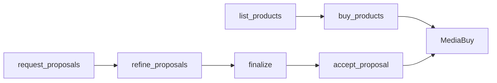
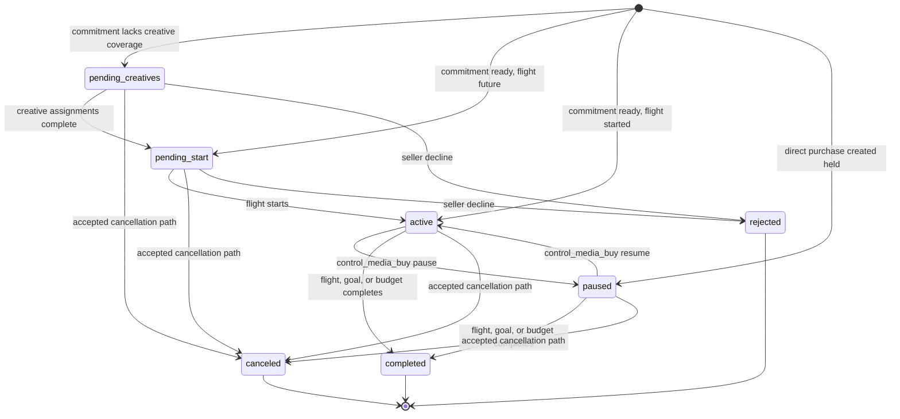

A MediaBuy is the operational resource created from accepted commercial terms.
AdCP 3.2 keeps three concerns separate:

1. **Commercial formation** chooses or negotiates the terms.
2. **Creative supply** attaches approved assets to the resulting packages.
3. **Operational control** changes delivery inside the accepted envelope.

That separation gives buyers and sellers an immutable commercial record while
allowing normal campaign operations to remain fast and revision-safe.

## Form the commercial commitment

Read `get_adcp_capabilities.media_buy.lifecycle_tools`, then choose an
advertised path:

| Path | Formation | Commitment |
|---|---|---|
| Published offer | `list_products` returns versioned seller offers | `buy_products` accepts selected offer terms and feed versions |
| Seller-planned | `request_proposals` and `refine_proposals` create immutable drafts | Finalize a draft into a committed hold, then call `accept_proposal` |

Both paths produce a MediaBuy with seller-issued `media_buy_id`, packages,
commercial readback, lifecycle status, and revision.



Use [Product discovery and planning](/dist/docs/3.2.0-rc.4/media-buy/product-discovery/) to
choose a path, and [Proposal negotiation](/dist/docs/3.2.0-rc.4/media-buy/product-discovery/proposal-negotiation)
for immutable revision and hold semantics.

## MediaBuy and package model

A MediaBuy contains:

- the accepted commercial snapshot and digest when formed from a proposal;
- aggregate budget, pacing, bidding, and daily-cap policy;
- one or more packages representing purchased products and their executable
  targeting, flight, pricing, and creative requirements;
- operational status, health, indicators, and revision history;
- correlation context and reporting configuration; and
- `revision`, `valid_actions`, and `available_actions` for safe routing.

Packages preserve the seller-confirmed execution contract. Important fields
include:

| Field | Meaning |
|---|---|
| `product_id` | Published or proposal-bound product that produced the package |
| `targeting_overlay` | Complete effective targeting, including seller resolution |
| `start_time` / `end_time` | Executable package flight |
| `budget` / `daily_budget_cap` | Package-level spend constraints when applicable |
| `formats_to_provide` | Immutable package-time format snapshots; contract-bearing entries remain after coverage and pin product, placement, execution version, and digests |
| `formats_pending` | Canonically equal subset of `formats_to_provide` that still lacks coverage |
| `creative_approvals[]` | Current assignment review state |
| `indicators[]` | Current seller observations such as pacing or inventory risk |

The buyer does not reconstruct package state from its original request. Read
the current seller snapshot through [`get_media_buys`](/dist/docs/3.2.0-rc.4/media-buy/task-reference/get_media_buys).

## State machine

| State | Meaning | Terminal? |
|---|---|---|
| `pending_creatives` | Commercially accepted; required creative coverage is missing | No |
| `pending_start` | Ready to serve; waiting for the flight to begin | No |
| `active` | Eligible to deliver | No |
| `paused` | Delivery is intentionally held | No |
| `completed` | Flight ended, goal completed, or budget exhausted | Yes |
| `rejected` | Seller declined before activation | Yes |
| `canceled` | Buyer or seller terminated the buy | Yes |



Task status is separate. `buy_products`, `accept_proposal`, and
`control_media_buy` may return `submitted`, `working`, or `input-required`
while an operation awaits systems or human review. The MediaBuy changes only
when that task completes. See [Task lifecycle](/dist/docs/3.2.0-rc.4/building/by-layer/L3/task-lifecycle).

## Supply and assign creatives

Compact purchase calls do not carry creative bodies. Use
[`sync_creatives`](/dist/docs/3.2.0-rc.4/creative/task-reference/sync_creatives) to create or
update library assets, then use `assignment_operations` to assign, unassign, or
replace package creatives.

```json
{
  "idempotency_key": "550e8400-e29b-41d4-a716-446655441050",
  "account": { "account_id": "account_123" },
  "assignment_operations": [
    {
      "operation": "assign",
      "creative_id": "creative_trail_video_30",
      "package_id": "package_streamhaus_video"
    }
  ]
}
```

Package-level `creative_deadline` takes precedence over the MediaBuy-level
deadline. After the deadline, the seller rejects new or replacement creative
assignments for that package. Creative library state and package assignment
state remain distinct: ending a buy releases assignments but does not delete a
reusable library creative.

## Control delivery inside accepted terms

Use [`control_media_buy`](/dist/docs/3.2.0-rc.4/media-buy/task-reference/control_media_buy) for
operational changes already permitted by the accepted commercial envelope:

- pause or resume delivery;
- exercise an accepted unilateral cancellation right;
- change total, aggregate-daily, or package budget controls;
- update allocation, pacing, bidding, targeting, catalog references, keywords,
  impression controls, or optimization goals; and
- change reporting-webhook configuration.

Every control includes the latest `revision` from `get_media_buys`:

```json
{
  "idempotency_key": "550e8400-e29b-41d4-a716-446655441051",
  "account": { "account_id": "account_123" },
  "media_buy_id": "media_buy_789",
  "revision": 4,
  "packages": [
    {
      "package_id": "package_streamhaus_video",
      "paused": true
    }
  ]
}
```

The seller atomically rejects a stale revision with `CONFLICT`. Re-read the
snapshot, reconcile the prior operation, and decide whether the original intent
still applies before retrying.

## Amend commercial terms

`control_media_buy` does not add products, change negotiated pricing or billing
terms, attach creatives, or move a flight outside the accepted envelope. When
an otherwise valid control requires new terms, the seller returns
`REQUOTE_REQUIRED`.

The buyer then:

1. reads `accepted_proposal_id` and the current terms from `get_media_buys`;
2. calls `refine_proposals` with `change_kind: "amendment"`;
3. verifies the immutable successor draft;
4. finalizes it into a committed hold; and
5. calls `accept_proposal` to apply the amendment atomically.

A cancellation requiring counterparty agreement uses the same lifecycle with
`change_kind: "cancellation"`. A cancellation right already granted in the
accepted terms can use `control_media_buy` directly.

## Read, reconcile, and report

Use the surfaces for their intended consistency level:

| Surface | Use |
|---|---|
| `get_media_buys` | Operational snapshot: state, revision, accepted proposal, packages, approvals, health, and optional near-real-time delivery |
| `get_media_buy_delivery` | Billing-grade delivery and dimensional reporting |
| Reporting webhooks | Push hints that delivery or health changed; repair from snapshots after gaps |
| Revision history | Append-only audit context for accepted operational changes |

Webhook arrival order is not resource order. Treat the snapshot as the repair
surface and compare resource revisions rather than transport timestamps. See
[Snapshot and log contract](/dist/docs/3.2.0-rc.4/protocol/snapshot-and-log).

## Seller implementation invariants

Sellers implementing the lifecycle should preserve these properties:

- Store MediaBuy status explicitly; do not recompute paused, canceled, or
  rejected state from flight dates.
- Enforce the revision comparison atomically with every control.
- Return the accepted proposal ID, digest, and complete snapshot for
  proposal-formed buys so restarted clients can amend safely.
- Keep creative assignment mutations separate from commercial controls.
- Persist account-scoped buys regardless of whether they were created through
  AdCP or another seller surface.
- Expose current routing through `available_actions` rather than requiring
  buyers to infer it from status.

## Compatibility boundary

Sellers without `media_buy.lifecycle_tools` continue to use the 3.x
`get_products`, `create_media_buy`, and `update_media_buy` facade. Keep that
translation in a version-adaptation layer. New business logic should reason in
terms of published offers, immutable proposals, accepted terms, and
revision-checked controls.

See [Migrating from 3.1 to 3.2](/dist/docs/3.2.0-rc.4/reference/migration/3-1-to-3-2) for the
mapping and [Media buy lifecycle flow](/dist/docs/3.2.0-rc.4/media-buy/media-buys/lifecycle) for
the detailed state and dependency reference.

## Continue

- [Optimization and reporting](/dist/docs/3.2.0-rc.4/media-buy/media-buys/optimization-reporting)
- [Indicators and warnings](/dist/docs/3.2.0-rc.4/media-buy/media-buys/indicators)
- [Accountability](/dist/docs/3.2.0-rc.4/media-buy/advanced-topics/accountability)
- [Policy compliance](/dist/docs/3.2.0-rc.4/media-buy/media-buys/policy-compliance)
