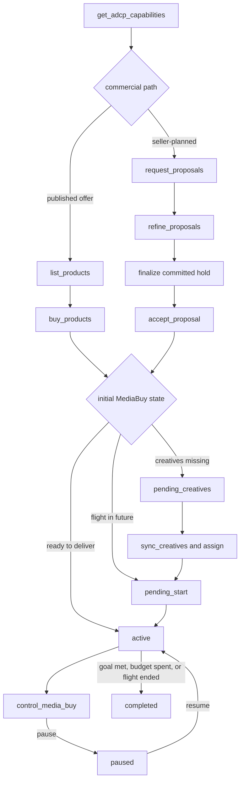
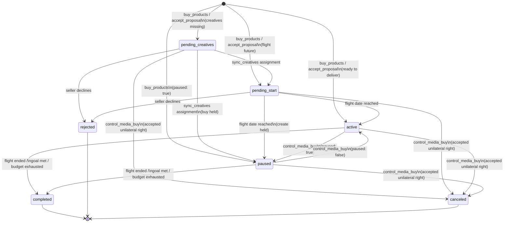
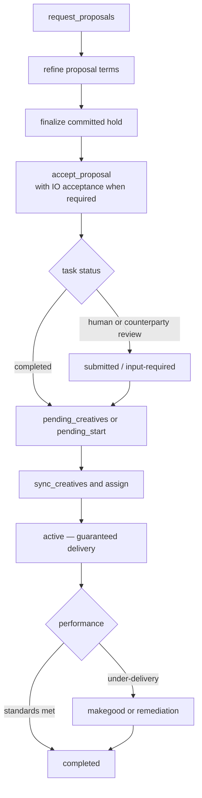

This page is the canonical sequence reference for media buy lifecycle. For conceptual background on the full lifecycle — campaign structure, package model, property targeting, and async operations — see [Media Buy Lifecycle](/dist/docs/3.2.0-rc.4/media-buy/media-buys/).

## AdCP 3.2 flow

Capability discovery determines how the commercial commitment is formed. The
two compact paths converge on the same MediaBuy lifecycle:



1. **Discover capabilities** — read `media_buy.lifecycle_tools` and related
   creative capabilities.
2. **Form the commercial commitment** — purchase a versioned published offer
   with `buy_products`, or accept a committed immutable proposal with
   `accept_proposal`.
3. **Supply creatives** — use `sync_creatives` and explicit assignment
   operations. Compact purchase calls never carry creative bodies.
4. **Operate and reconcile** — read `get_media_buys`, apply in-envelope changes
   with `control_media_buy`, and use `get_media_buy_delivery` for reporting.

Commercial changes outside the accepted envelope return `REQUOTE_REQUIRED`.
Begin an amendment from the snapshot's `accepted_proposal_id`, then revise,
finalize, and accept the successor proposal.

### Compact operations form a saga

Each compact mutation is atomic by itself, but a workflow containing more than
one mutation is not atomic as a group. In particular, purchase followed by
creative sync has this boundary:

1. `buy_products` or `accept_proposal` commits the MediaBuy and returns
   `purchase_bindings[]` with seller-assigned package IDs.
2. `sync_creatives` uploads library creatives and applies assignment operations.
3. A failure in step 2 leaves step 1 committed. The buyer reads the MediaBuy,
   fixes and retries trafficking, or exercises an available cancellation right.

The same rule applies when a legacy `update_media_buy` request is decomposed
into proposal acceptance, operational control, and creative sync. Those calls
have independent validation, authorization, idempotency, async-task, and
failure boundaries. A commercial amendment can succeed while the following
control or creative assignment fails, and a control can succeed while a later
assignment fails. Implementations MUST NOT describe such a sequence as an
atomic translation of the compatibility facade.

Some compatibility requests therefore require the facade itself. A placement
targeting patch that removes a placement used by an assignment must
replace or reroute that assignment in the same `update_media_buy` mutation.
`control_media_buy` cannot carry creative assignments, so `control_media_buy`
followed by `sync_creatives` is not equivalent. Inline-only creative sellers
also have no compact creative continuation and use `create_media_buy` or
`update_media_buy` for package-scoped bodies.

Other facade-only or explicitly lossy create shapes include
`artifact_webhook`, per-package initial pause, inline catalog bodies or filters,
and a buyer-authored exact `committed_metrics` set. Compact callers synchronize
catalogs before purchase and accept that a catalog can remain after a failed
purchase. Direct compact purchase derives reporting commitments from published
terms; an exact set is lossless only when it is already captured by the
proposal being accepted.

## State machine

### Media buy states

| State | Meaning | Terminal? |
|-------|---------|-----------|
| `pending_creatives` | Approved; no creatives assigned yet | No |
| `pending_start` | Creatives assigned; waiting for flight date | No |
| `active` | Delivering impressions | No |
| `paused` | Temporarily halted | No |
| `completed` | Flight ended, goal met, or budget exhausted | Yes |
| `rejected` | Seller declined the buy | Yes |
| `canceled` | Buyer or seller terminated before completion | Yes |

<Note>
`submitted`, `working`, and `input-required` are **task-level** statuses. They
describe an operation such as `buy_products` or `accept_proposal`, not the
MediaBuy itself. The completion artifact creates or updates the MediaBuy, whose
state is then read through `get_media_buys`. See [task status and MediaBuy state](/dist/docs/3.2.0-rc.4/media-buy/media-buys#state-machine).
</Note>

### Transitions



### Discovering valid actions at runtime

Rather than hardcoding the state machine, read `valid_actions` from `get_media_buys`. The seller returns exactly what the buyer can do in the current state:

```json
{
  "media_buy_id": "mb_12345",
  "status": "active",
  "revision": 3,
  "valid_actions": ["pause", "cancel", "update_budget", "update_dates", "update_packages", "add_packages", "sync_creatives"]
}
```

`control_media_buy` requires the latest `revision`. The seller rejects a stale
revision with `CONFLICT`, so concurrent controls cannot silently overwrite one
another. `available_actions` tells compact clients whether the next change
routes to `control_media_buy`, proposal refinement, creative assignment, or
another task. Prefer it over inferring routing from the state enum.

A display-name-only change routes to `control_media_buy`. `name` is
revision-checked non-commercial metadata: changing it increments the MediaBuy
revision without changing the accepted terms or creating an accepted-proposal
successor.

Use `sync_creatives.assignment_operations` for creative changes. Creative
assignment is independent from commercial control and does not increment the
MediaBuy revision merely because an assignment changed. There is no shared
optimistic-concurrency fence between `sync_creatives` and
`control_media_buy`: a successful sync can change assignment state while the
MediaBuy `revision` remains unchanged. By contrast, a creative-assignment or
inline-creative mutation performed inside the `update_media_buy` compatibility
facade is part of that atomic MediaBuy update and MUST increment `revision`.
Clients mixing the two surfaces must re-read both package assignments and the
MediaBuy before computing a replacement; the revision alone cannot prove that
assignment state is unchanged.

## Guaranteed / PG deal variation

Guaranteed products require contractual commitment before delivery begins. In
the compact lifecycle, sellers normally express negotiated guaranteed terms as
a committed proposal:



### What makes a guaranteed buy different

**Accountability terms are part of the accepted commercial snapshot.** A
guaranteed proposal can carry:

- `performance_standards` — viewability, IVT, completion rate, and other thresholds with measurement vendor
- `measurement_terms` — who counts the billing metric, acceptable variance, and makegood remedies
- `cancellation_policy` — notice period and cancellation fee for early termination

Omitting any of these on a guaranteed package causes the seller to return `TERMS_REJECTED`.

**IO acceptance** — `accept_proposal` can include structured `io_acceptance`
when the committed terms require it. The operation may still return
`submitted` or `input-required` while the seller completes human or
counterparty review. Poll with `get_task_status` or use the configured task
webhook. The completion artifact carries the `media_buy_id`.

**Makegoods** — if the seller under-delivers against agreed `performance_standards`, they propose a remedy from the `makegood_policy`: `additional_delivery`, `credit`, or `invoice_adjustment`. The buyer accepts or disputes.

<Note>
A seller who accepts without under-delivering earns a favorable accountability
signal. See [Accountability](/dist/docs/3.2.0-rc.4/media-buy/advanced-topics/accountability) for
performance standards, measurement terms, and makegood resolution.
</Note>

## Creative sync timing

### When creatives are required

`buy_products` and `accept_proposal` do not accept creative bodies. After
commitment, supply or update library creatives with `sync_creatives`, then use
explicit `assignment_operations` to assign them to packages. A compact seller
advertises the creative workflow it supports; callers should not infer an
inline-creative path from older tool availability.

This sequence does not move request-time validation across the commitment
boundary. On the compatibility facades, one invalid inline creative or
assignment fails the complete create or update without mutation. On the compact
path, the buy already exists when package-aware creative validation runs. A
strict sync prevents partial creative or assignment mutation within that sync,
but it cannot undo the preceding purchase. Later policy review is different
from either validation case: a review rejection does not roll back a valid
facade mutation or compact purchase.

When required formats lack creative coverage, the buy enters
`pending_creatives`. After assignments cover the package's effective
`format_options[]`, it moves to `pending_start` when the flight is in the future
or `active` when delivery can begin. A direct `buy_products` call may set
`paused: true`; resume it later with `control_media_buy` and the latest
revision.

### The `creative_deadline`

The MediaBuy snapshot can carry a `creative_deadline`; individual packages may
carry their own. **Package-level deadlines take precedence over the MediaBuy
deadline.** This matters for mixed-channel orders—a print package may have a
material deadline days before digital packages in the same buy.

After the deadline, new or replacement assignments for that package return
`CREATIVE_REJECTED`. Delivery continues with the currently assigned creatives,
or the package remains `pending_creatives` if none were accepted.

```
Deadline hierarchy:
  package.creative_deadline  (if present — wins)
    ↓ else
  media_buy.creative_deadline
```

### Effect on creatives when a buy ends

When a media buy reaches `rejected`, `canceled`, or `completed`, creative assignments are released. For library-backed sellers, the creatives themselves are not deleted — they remain in the library with their existing review status and are available for assignment to other media buys. Inline-only sellers may retain package-scoped creative records for audit and reporting without exposing reusable library entries.

## Health and dependency impairment

`status` describes operational state — is the buy serving, paused, or terminal? **`health`** is a separate orthogonal field describing whether upstream dependencies are intact:

| Field | Tracks | Values |
|-------|--------|--------|
| `status` | Operational state | `pending_creatives`, `pending_start`, `active`, `paused`, `completed`, `rejected`, `canceled` |
| `health` | Dependency state | `ok`, `impaired` |

The two are orthogonal. A buy can be `paused`-and-impaired, `pending_creatives`-and-impaired, or `active`-and-impaired. Health does not change `status`; `valid_actions` is unaffected.

### When `health` is `impaired`

`health` transitions to `impaired` when an upstream dependency referenced by the buy enters an offline state that affects delivery for at least one package:

- An audience the buy targets transitions to `suspended` (consent expiry, TTL, policy enforcement).
- A creative the buy uses transitions from `approved` to `suspended` (recoverable dependency/authorization loss), from `suspended` to `rejected` (terminal dependency/authorization loss), or from `approved` to `rejected` (post-approval revocation).
- A catalog item the buy targets transitions to `withdrawn` (seller-initiated removal).
- An event source the buy depends on enters `insufficient` (zero events received).
- A property the buy targets is depublished via brand.json / adagents.json.

The buy's `impairments[]` array carries one entry per affected dependency:

```json
{
  "media_buy_id": "mb_456",
  "status": "active",
  "health": "impaired",
  "impairments": [
    {
      "impairment_id": "imp_01HZX9...",
      "resource_type": "audience",
      "resource_id": "aud_123",
      "package_ids": ["pkg_a"],
      "transition": { "from": "ready", "to": "suspended" },
      "reason_code": "consent_expired",
      "reason": "Hashed identifier consent basis expired on 2026-06-01.",
      "observed_at": "2026-06-02T14:11:00Z",
      "remediation": "Re-sync audience after refreshing consent upstream."
    }
  ]
}
```

### Materiality

Each entry in `impairments[]` MUST list at least one package whose ability to serve is degraded. Cosmetic effects (one rejected creative in a package that still has serviceable peers) MUST NOT be reported as impairments — they're surfaced via the resource's own status, not the buy's.

### Reverse direction

When the underlying resource returns to a serviceable state (audience re-syncs, creative re-approved), the seller MUST remove the corresponding entry from `impairments[]` and flip `health` to `ok` if no other impairments remain. The buyer sees the recovered state on the next snapshot read or via the next `impairment` push (which carries the closure).

### Pushed via `impairment` webhook

When a buy's `health` transitions or an impairment is added/removed, the seller fires an `impairment` notification against the buy's `push_notification_config`. The payload reuses the `impairment` object shape plus the buy's updated `health`. See the [persistent webhook contract](/dist/docs/3.2.0-rc.4/building/by-layer/L3/webhooks#persistent-channel-contract) for delivery semantics (at-least-once, no-ordering, coalescence, replay via snapshot).

Impairment webhooks identify affected packages with `package_ids[]` by design. Buyers that need package-level correlation context, such as `context.buyer_ref`, should call `get_media_buys` after receiving an impairment fire and read the package snapshot.

### Materiality coverage

The MUST-strength materiality rule applies to resource types where the resource → buy join is cheap and 1:N — audience, event_source, property. For creative and catalog_item, materiality is SHOULD-strength: a creative in a large pool may not degrade serving when removed, and the join is more expensive for sellers to compute. Implementers SHOULD report conservatively when uncertain and MUST NOT report when serving is provably unaffected.

### Remediation by `reason_code`

Each `reason_code` has a typical buyer remediation path. Sellers don't fill this in per-impairment — buyer agents key remediation off `reason_code` directly. The table below is the protocol-level guidance; the per-impairment free-text `remediation` field carries seller-specific context that doesn't fit the typical path (e.g., "we restored this audience yesterday; sync now to pick up the refresh").

| `reason_code` | Typical buyer remediation |
|---|---|
| `consent_expired` | Refresh upstream consent (e.g., hashed-id consent renewal on a clean-room flow), then re-sync the audience via `sync_audiences`. |
| `ttl_expired` | Re-sync the audience via `sync_audiences` to renew. |
| `pii_audit_failed` | Address audit findings upstream (hashing, identifier hygiene). Re-sync only **after** the seller signals the audit is cleared — a buyer agent that loops `sync_audiences` against an uncleared audit will not converge. |
| `content_rejected` | Fix or replace the asset through `sync_creatives`, then use an explicit assignment operation. Campaign-level replace-versus-wait policy stays with the buyer. |
| `identity_authorization_revoked` | Restore the downstream identity/post authorization through the seller's connection flow, or replace the affected `published_post` creative if authorization cannot be restored. |
| `identity_authorization_expired` | Renew the downstream identity/post authorization through the seller's connection flow, then let the seller re-check or re-review the creative. |
| `source_private` | Restore source post visibility or replace the affected `published_post` reference. |
| `source_offline` | Verify the tag is firing on the buyer's properties (this is often a buyer/publisher integration issue, not a seller-side outage), then re-sync via `sync_event_sources`. |
| `seller_removed` | No buyer-side resubmit path. Find a replacement through `list_products` or `request_proposals`, inspect canonical product format options, or contact the seller for restoration ETA. |
| `policy_violation` | Seller-side enforcement; buyer-side resubmit unlikely to clear. Await resolution or escalate per the seller's standard contact path. |
| `property_depublished` | No buyer-side fix — property publication is controlled by the publisher's `brand.json` / `adagents.json`. Find a replacement through product listing or proposal planning, or remove it from targeting. |

### Triage ordering

Buyer agents triaging a non-empty `impairments[]` SHOULD sort entries by `observed_at` ascending — the oldest open impairment is the most likely to have already eaten into delivery. Webhook arrival time is not a reliable proxy: under the coalescence rule (see [webhooks § Coalescence](/dist/docs/3.2.0-rc.4/building/by-layer/L3/webhooks#coalescence)) the seller MAY batch multiple state changes into one fire, and re-emission under a fresh `idempotency_key` resets the transport timestamp without changing `observed_at`.

### Impairments are operational signals, not commercial events

An `impairment` reports degraded delivery from upstream dependency change. It is **not** a billing event, makegood trigger, or credit dispute. Commercial remedies for under-delivery are governed by `accountability_terms` on guaranteed buys and remain out of scope for this surface. Integrators building dispute pipelines should drive them from delivery reports and accountability terms, not from `impairments[]`.

### Compliance

The `impairment.coherence` assertion verifies that the buy's `impairments[]` surface stays in sync with the underlying resources it references. It is a cross-resource invariant — it observes both the resource transition and the buy snapshot in the same compliance run.

**Forward rule.** Every entry in a buy's `impairments[]` MUST reference a resource whose current status is an offline state — `audience: suspended` (on `audience-status`), `creative: suspended` or `creative: rejected` (on `creative-status`), `catalog_item: withdrawn` (on `catalog-item-status`), `event_source: insufficient` (the `assessment-status` value surfaced through `event-source-health.status`), or a property depublished via `brand.json` / `adagents.json`. A buy reporting an impairment whose referenced resource is no longer offline fails the check — the seller has stale state on the buy.

**Inverse rule.** Any resource in an offline state that is referenced by a non-terminal buy MUST appear in that buy's `impairments[]`. A seller that transitions a resource without propagating to the affected buys fails the check — the seller has stale state on the resource.

**Health-iff rule.** A non-terminal buy's `health` MUST be `impaired` whenever `impairments[]` is non-empty, and MUST be `ok` whenever `impairments[]` is empty. This is a strict iff — stale `health: "impaired"` with an empty `impairments[]` (or `health: "ok"` with a non-empty `impairments[]`) violates the rule even when the forward and inverse rules are individually satisfied.

**Out of scope.** All three rules relax on buys in terminal status (`completed`, `canceled`, `rejected`). Sellers MAY leave `impairments[]` and `health` in whatever state they held at the terminal transition — they are not required to clean up. Buyers MUST NOT treat post-terminal drift as a coherence violation; the buy is no longer serving and synchronisation is wasted effort. Materiality (the requirement that `package_ids` be non-empty) is enforced at the schema layer by `package_ids: minItems: 1` on `impairment.json` — `impairment.coherence` does not re-check it.

**Snapshot is one of several propagation surfaces.** Sellers declare which surfaces they use via [`capabilities.media_buy.propagation_surfaces`](https://adcontextprotocol.org/schemas/3.2.0-rc.4/protocol/get-adcp-capabilities-response.json) on `get_adcp_capabilities` — a non-exclusive array, so a seller mirroring impairments on both the buy snapshot AND firing webhooks declares `["snapshot", "webhook"]` (the common case for premium guaranteed sellers). The three surface values:

- **`snapshot`** — seller populates `health` + `impairments[]` on `get_media_buys` reads. The contract above governs this surface; `impairment.coherence` storyboards grade it when declared, `not_applicable` otherwise.
- **`webhook`** — seller fires `notification-type: impairment` webhooks via `push_notification_config`. Subject to the persistent-channel webhook contract.
- **`out_of_band`** — seller propagates via channels outside the AdCP protocol surface (email, dashboard, partner-specific feeds). Long-tail and enterprise-bundled platforms commonly use this when impairment workflows are managed in human channels. Sellers declaring only `["out_of_band"]` are not graded by snapshot or webhook compliance — their bar is the offline agreement.

Default when absent is `["snapshot"]`. Each surface is independent of the others; declare the actual mix of surfaces buyers will observe on the agent. A seller with impairment data in their API under a non-AdCP field name (a mapping gap) SHOULD document the mapping rather than declare `out_of_band` — the spec's gap is what `out_of_band` legitimately covers.

**Relationship to other invariants.** `impairment.coherence` complements `status.monotonic`, which observes single-resource transitions only. The two run together on every specialism whose storyboard exercises both a resource-state transition and a media-buy snapshot read — audience-sync, creative-ad-server, creative-template, creative-generative, sales-catalog-driven. The cross-resource exercise that drives non-NA grading is the dependency-impairment storyboard (`media_buy_seller/dependency_impairment`, creative-track), which forces a creative on an active buy into an offline state (`approved → suspended` for recoverable dependency loss or `approved/suspended → rejected` for terminal revocation), verifies the buy reflects `health: impaired` with a matching `impairments[]` entry, recovers or replaces the creative, and verifies the buy returns to `health: ok` with `impairments[]` cleared. Audience-track and catalog-track variants are follow-ups, pending `force_audience_status` / `force_catalog_item_status` support in the compliance test controller.

See the [Snapshot and log contract](/dist/docs/3.2.0-rc.4/protocol/snapshot-and-log) for the read-side rules that tie `impairments[]` (snapshot) to the `impairment` push (log).

<Tip>
For library-backed sellers, creative library state and creative assignment state are tracked independently. A creative that was assigned to a canceled buy still has whatever review status it earned and can be immediately assigned to a new buy. Inline-only sellers expose package-scoped creative status on `get_media_buys` but do not advertise reusable library creatives. See [creative state and assignment state](/dist/docs/3.2.0-rc.4/creative/creative-libraries#creative-state-and-assignment-state-are-separate).
</Tip>

## See also

- [Media Buy Lifecycle](/dist/docs/3.2.0-rc.4/media-buy/media-buys/) — full lifecycle reference: campaign structure, package model, async operations
- [`buy_products`](/dist/docs/3.2.0-rc.4/media-buy/task-reference/buy_products) — purchase versioned published offers directly
- [`accept_proposal`](/dist/docs/3.2.0-rc.4/media-buy/task-reference/accept_proposal) — accept committed new-buy, amendment, or cancellation terms
- [`control_media_buy`](/dist/docs/3.2.0-rc.4/media-buy/task-reference/control_media_buy) — apply revision-checked operational controls
- [`sync_creatives`](/dist/docs/3.2.0-rc.4/creative/task-reference/sync_creatives) — upload and update library creatives when the seller advertises `creative.has_creative_library: true`
- [Accountability](/dist/docs/3.2.0-rc.4/media-buy/advanced-topics/accountability) — performance standards, measurement terms, makegood resolution
- [Optimization & Reporting](/dist/docs/3.2.0-rc.4/media-buy/media-buys/optimization-reporting) — delivery monitoring, dimensional reporting, campaign updates
