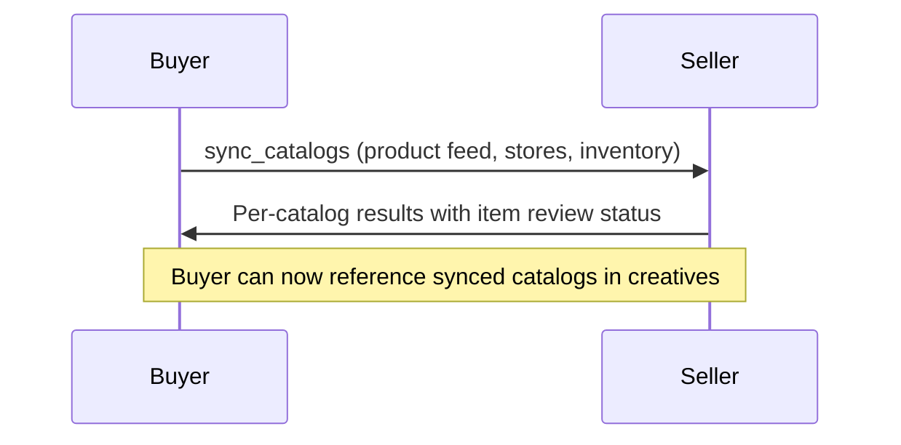

Manage buyer-provided catalog feeds on a seller account. Sync product feeds, inventory data, store locations, offerings, and industry-vertical catalogs (hotel, flight, job, vehicle, real estate, education, destination). Supports URL-based feeds with scheduled re-fetch, inline item data, discovery of existing catalogs, and immediate suppression or restoration of specific items.

**Terminology.** `sync_catalogs` manages buyer-provided data feeds that a seller uses to render or target ads. This is separate from the seller-side wholesale product feed exposed by `get_products buying_mode: "wholesale"` and the wholesale signals feed exposed by `get_signals discovery_mode: "wholesale"`; webhooks are the push layer for changes to those seller-side feeds.

**Response Time**: Instant to days (returns `completed` for small catalogs, or `submitted` for large feeds requiring platform review)

**Request Schema**: [`/schemas/3.2.0-rc.4/media-buy/sync-catalogs-request.json`](https://adcontextprotocol.org/schemas/3.2.0-rc.4/media-buy/sync-catalogs-request.json)
**Response Schema**: [`/schemas/3.2.0-rc.4/media-buy/sync-catalogs-response.json`](https://adcontextprotocol.org/schemas/3.2.0-rc.4/media-buy/sync-catalogs-response.json)

## Who calls whom

The **buyer** calls `sync_catalogs` on the **seller** to push catalog feeds to the seller's account. The seller validates items, runs content policy checks, and returns per-item approval status.



This task sits between format discovery and creative submission in the [account state setup sequence](/dist/docs/3.2.0-rc.4/building/by-layer/L2/account-state):

1. [`get_products`](/dist/docs/3.2.0-rc.4/media-buy/task-reference/get_products) — check canonical `format_options[].params.slots[]` for catalog requirements
2. **`sync_catalogs`** — push the required feeds to the account
3. [`sync_creatives`](/dist/docs/3.2.0-rc.4/creative/task-reference/sync_creatives) — submit creatives that reference synced catalogs by `catalog_id`
4. [`create_media_buy`](/dist/docs/3.2.0-rc.4/media-buy/task-reference/create_media_buy) — launch the campaign

## Quick start

Sync a product feed:

```json
{
  "account": { "account_id": "acct_acmecorp" },
  "catalogs": [
    {
      "catalog_id": "product-feed",
      "name": "Acme Product Catalog",
      "type": "product",
      "url": "https://feeds.acmecorp.com/products.xml",
      "feed_format": "google_merchant_center",
      "update_frequency": "daily"
    }
  ]
}
```

## Request parameters

| Parameter | Type | Required | Description |
|-----------|------|----------|-------------|
| `account` | [account-ref](/dist/docs/3.2.0-rc.4/building/by-layer/L2/accounts-and-agents#account-references) | Yes | Account containing the catalogs. Pass `{ "account_id": "..." }` or an implicit-resolution reference supported by the seller. |
| `catalogs` | Catalog[] | No | Catalog feeds to sync (max 50). Omit for an availability-only call; omit with both availability arrays for discovery mode. |
| `item_availability_updates` | CatalogItemAvailabilityUpdate[] | No | Immediate revision-guarded suppress/restore operations for items in buyer-managed catalogs. |
| `item_availability_queries` | CatalogItemAvailabilityRef[] | No | Read current availability and `overlay_revision`. Queries run after updates in a mixed request. |
| `catalog_ids` | string[] | No | Limit sync scope to specific catalog IDs. Others on the account are unaffected. |
| `delete_missing` | boolean | No | When true, buyer-managed catalogs not in this sync are removed. Does not affect seller-managed catalogs. Requires `catalogs` to be present. Default: false. |
| `dry_run` | boolean | No | Preview changes without applying. Default: false. |
| `validation_mode` | string | No | `"strict"` (default) rejects the whole operation before mutation on any entry error. `"lenient"` processes valid entries and returns positionally matched failed results for invalid item references. |
| `push_notification_config` | object | No | Webhook configuration for async completion notification. |

## Immediate item availability

`item_availability_updates` lets the buyer correct time-sensitive availability without re-sending a full feed or waiting for the next scheduled fetch. It applies only to catalogs the buyer manages on the seller account. Seller-owned wholesale inventory and seller policy removals continue to use the seller's wholesale-feed and impairment lifecycles.

Before sending updates, check [`get_adcp_capabilities`](/dist/docs/3.2.0-rc.4/protocol/get_adcp_capabilities) for:

```json
{
  "media_buy": {
    "features": {
      "catalog_management": true,
      "catalog_item_availability_updates": true
    }
  }
}
```

A suppression is an availability overlay, not a change to seller review status. Once the seller acknowledges `applied` or `unchanged`, it MUST prevent further selection or dynamic rendering, including every cached or pre-generated creative materialized from the item. Internal lineage therefore uses `(resolved_account_id, catalog_id, catalog_generation, item_id)`; shorter keys are unsafe. Static creatives supplied or promoted without catalog lineage remain outside this automatic guarantee and use the creative lifecycle. `unchanged` is valid only when the requested overlay and expiry already match persisted state.

`catalog_generation` is an opaque seller-issued token returned on catalog results and discovery when this capability is advertised. It is stable across ordinary upserts and feed refreshes, changes after deletion and recreation, and is never reused for the same account and `catalog_id`. This prevents a delayed update from applying to a new catalog that reused the buyer's ID.

`item_id` is the exact canonical key used by `Catalog.ids`: `offering_id`, `store_id`, `hotel_id`, `flight_id`, `job_id`, `vehicle_id`, `listing_id`, `program_id`, `destination_id`, or `app_id` for those typed catalogs. Product, inventory, and promotion feeds use the stable normalized source identifier retained during ingestion.

A restore removes only the buyer-authored suppression. The item remains subject to seller approval, policy, rights, inventory, and other controls. If the item is absent, restore is allowed only when a prior overlay or tombstone exists in the same catalog generation; otherwise it fails with [`REFERENCE_NOT_FOUND`](/dist/docs/3.2.0-rc.4/building/verification/compliance-catalog#error-code-reference-not-found).

Each `(catalog_id, catalog_generation, item_id)` tuple can appear only once in the update array. A duplicate
is an operation-level [`INVALID_REQUEST`](/dist/docs/3.2.0-rc.4/building/verification/compliance-catalog#error-code-invalid-request) before mutation in both validation
modes. The combined update and query count cannot exceed 1,000; buyers chunk larger workloads. Excess entries fail before lookup or mutation. For any mixed request, the seller validates and stages catalog upserts and availability updates, evaluates queries against that post-upsert/post-update candidate state, and then commits once before returning query results. If it cannot commit synchronously and atomically, it rejects before any mutation.

Suppression persists across scheduled feed fetches and ordinary catalog upserts;
only an explicit `restore`, the optional `expires_at`, or deletion of the containing catalog clears it. This
prevents the next hourly feed refresh from accidentally re-enabling an item. A
restore can clear an existing overlay while the item is temporarily absent only
when the seller retained its prior overlay or tombstone in that generation.

Availability updates are always synchronous. A seller MUST NOT return
`status: "submitted"` for a request containing them. If a mixed request's catalog
upserts require async processing, the seller rejects it with `INVALID_REQUEST`
before mutation and the buyer sends the immediate availability update and the
catalog sync as separate calls. `dry_run: true` is not allowed with availability
updates because their result statuses acknowledge real persisted state, not a
preview.

Every update includes `expected_overlay_revision`, obtained from a current-state query. Revision 0 is the initial active state. Each applied suppress, applied restore, and automatic expiry increments it exactly once; unchanged updates, reads, and idempotent replays do not. A mismatch returns [`CONFLICT`](/dist/docs/3.2.0-rc.4/building/verification/compliance-catalog#error-code-conflict) without mutation, so concurrent suppress/restore operations cannot overwrite one another.

`validation_mode` does not weaken the request envelope. Schema errors, duplicate identities, an undeclared capability, batch-limit excess, `dry_run` conflicts, and a mixed request that cannot commit atomically are operation-level failures before lookup or mutation in both modes. For entry failures, `strict` rejects the whole operation before mutation; `lenient` returns a failed result in its request position and processes valid entries. Unknown, inaccessible, unauthorized, and stale-generation references are observationally identical: `code: "REFERENCE_NOT_FOUND"`, message exactly `Catalog item not found`, recovery `correctable`, and no field, suggestion, retry hint, issues, details, or resource metadata. Sellers use the same authorization/lookup failure path and avoid materially distinguishable timing. A known seller-managed catalog may return `INVALID_REQUEST` only after access is authorized.

Responses contain exactly one update result per update and one state result per query, in request order. Every result carries `request_index` and echoes the complete identity (and action for updates). Buyers reject count, order, index, or echo mismatches rather than correlating heuristically. A response with `replayed: true` is historical; after expiry, deletion, or uncertainty, issue a query with a fresh idempotency key before treating it as current.

The overlay applies to active packages and future item selection, but it does
not change `catalog-item-status` to `withdrawn`, pause or cancel a media buy, or
create a seller-removal impairment. The buyer intentionally requested this
state and receives its acknowledgement directly. If suppressing the last
eligible item leaves a package unable to deliver, the buyer restores or replaces
the item or controls the buy; the seller continues normal delivery and
underdelivery reporting.

```json
{
  "idempotency_key": "d4a8f1b2-0123-489f-a123-45678901234d",
  "account": { "account_id": "acct_acmecorp" },
  "item_availability_updates": [
    {
      "catalog_id": "product-feed",
      "catalog_generation": "catgen_01K2ABCD",
      "item_id": "SKU-12345",
      "expected_overlay_revision": 0,
      "action": "suppress",
      "reason": "out_of_stock",
      "expires_at": "2027-12-31T23:59:59Z"
    },
    {
      "catalog_id": "product-feed",
      "catalog_generation": "catgen_01K2ABCD",
      "item_id": "SKU-67890",
      "expected_overlay_revision": 3,
      "action": "restore",
      "reason": "back_in_stock"
    }
  ]
}
```

Read current state before writing (and after any replay whose snapshot may be stale):

```json
{
  "idempotency_key": "e5b9a2c3-1234-48af-b234-56789012345e",
  "account": { "account_id": "acct_acmecorp" },
  "item_availability_queries": [
    {
      "catalog_id": "product-feed",
      "catalog_generation": "catgen_01K2ABCD",
      "item_id": "SKU-12345"
    }
  ]
}
```

Standard reasons are `out_of_stock`, `back_in_stock`, `content_unavailable`, `content_available`, `promotion_start`, `promotion_end`, `time_window_started`, `time_window_expired`, `buyer_request`, and `other`. When using `other`, include `reason_detail`.

Price, copy, and asset changes are catalog content updates, not availability transitions; send those through the ordinary `catalogs` upsert path.

### Catalog object

Each catalog in the `catalogs` array is a [Catalog](/dist/docs/3.2.0-rc.4/creative/catalogs#the-catalog-object) object. Key fields:

| Field | Type | Required | Description |
|-------|------|----------|-------------|
| `catalog_id` | string | Yes | Buyer's identifier. Used to match existing catalogs for upsert. |
| `type` | CatalogType | Yes | Catalog type: `product`, `offering`, `inventory`, `store`, `promotion`, `hotel`, `flight`, `job`, `vehicle`, `real_estate`, `education`, `destination` |
| `url` | uri | No | External feed URL. Mutually exclusive with `items`. |
| `feed_format` | string | No | Feed format: `google_merchant_center`, `facebook_catalog`, `shopify`, `linkedin_jobs`, `custom` |
| `update_frequency` | string | No | Re-fetch schedule: `realtime`, `hourly`, `daily`, `weekly` |
| `items` | object[] | No | Inline catalog data. Mutually exclusive with `url`. |
| `conversion_events` | EventType[] | No | Event types representing conversions for items in this catalog |

## Response

**Success response** — per-catalog results:

| Field | Type | Description |
|-------|------|-------------|
| `catalogs` | object[] | Results for each catalog processed |
| `catalogs[].catalog_id` | string | Catalog ID from request |
| `catalogs[].catalog_generation` | string | Immutable catalog-incarnation token; returned for accessible buyer-managed catalogs when availability updates are supported |
| `catalogs[].action` | string | `created`, `updated`, `unchanged`, `failed`, `deleted` |
| `catalogs[].platform_id` | string | Platform-assigned ID |
| `catalogs[].item_count` | integer | Total items after sync |
| `catalogs[].items_approved` | integer | Items approved by platform |
| `catalogs[].items_pending` | integer | Items awaiting review |
| `catalogs[].items_rejected` | integer | Items rejected |
| `catalogs[].item_issues` | object[] | Per-item rejection reasons |
| `catalogs[].next_fetch_at` | datetime | Next scheduled feed fetch (URL-based catalogs) |
| `item_availability_updates` | object[] | Positionally matched acknowledgements for every requested availability update |
| `item_availability_updates[].request_index` | integer | Zero-based request position |
| `item_availability_updates[].catalog_id` | string | Catalog ID echoed from the request |
| `item_availability_updates[].catalog_generation` | string | Catalog generation echoed from the request |
| `item_availability_updates[].item_id` | string | Item ID echoed from the request |
| `item_availability_updates[].action` | string | `suppress` or `restore`, echoed from the request |
| `item_availability_updates[].status` | string | `applied`, `unchanged`, or `failed` |
| `item_availability_updates[].availability` | string | Persisted `active` or `suppressed` state after an applied or unchanged result |
| `item_availability_updates[].overlay_revision` | integer | Persisted revision after an applied or unchanged result |
| `item_availability_updates[].expires_at` | datetime | Present only while the persisted state is suppressed with an expiry |
| `item_availability_updates[].applied_at` | datetime | Required when applied; optional when unchanged if the seller knows when the existing state took effect |
| `item_availability_updates[].errors` | Error[] | Required when that item update failed |
| `item_availability_states` | object[] | Current-state results for every requested query |
| `item_availability_states[].request_index` | integer | Zero-based request position |
| `item_availability_states[].catalog_id` | string | Catalog ID echoed from the request |
| `item_availability_states[].catalog_generation` | string | Catalog generation echoed from the request |
| `item_availability_states[].item_id` | string | Item ID echoed from the request |
| `item_availability_states[].status` | string | `found` or `failed` |
| `item_availability_states[].availability` | string | Current buyer-authored `active` or `suppressed` overlay state when found |
| `item_availability_states[].overlay_revision` | integer | Current optimistic-concurrency token when found |
| `item_availability_states[].expires_at` | datetime | Present only while the current state is suppressed with an expiry |
| `item_availability_states[].updated_at` | datetime | Timestamp of the state represented by `overlay_revision` when found |
| `item_availability_states[].errors` | Error[] | Required when the item reference could not be read |

Each suppress request may include `expires_at`. At that instant, the seller
automatically removes the buyer-authored overlay as if it received a restore.
Omit it for an indefinite suppression; it is invalid on restore requests. A
repeated suppress replaces the prior expiry: a changed timestamp, or omission
that clears a previous timestamp, returns `applied`. `unchanged` is only correct
when both the suppression state and expiry already match the request.

**Error response** — operation failed entirely:

| Field | Type | Description |
|-------|------|-------------|
| `errors` | Error[] | Operation-level errors (auth failure, service unavailable) |

Responses use discriminated unions — a synchronous success has `status: "completed"`, always contains `catalogs` (an empty array for an availability-only call), and may contain update or state results; an operation-level failure contains `errors` instead.

### Availability update response

```json
{
  "status": "completed",
  "catalogs": [],
  "item_availability_updates": [
    {
      "request_index": 0,
      "catalog_id": "product-feed",
      "catalog_generation": "catgen_01K2ABCD",
      "item_id": "SKU-12345",
      "action": "suppress",
      "status": "applied",
      "availability": "suppressed",
      "overlay_revision": 1,
      "expires_at": "2027-12-31T23:59:59Z",
      "applied_at": "2026-08-16T08:30:00Z"
    },
    {
      "request_index": 1,
      "catalog_id": "product-feed",
      "catalog_generation": "catgen_01K2ABCD",
      "item_id": "SKU-67890",
      "action": "restore",
      "status": "unchanged",
      "availability": "active",
      "overlay_revision": 3
    }
  ]
}
```

### Availability state response

```json
{
  "status": "completed",
  "catalogs": [],
  "item_availability_states": [
    {
      "request_index": 0,
      "catalog_id": "product-feed",
      "catalog_generation": "catgen_01K2ABCD",
      "item_id": "SKU-12345",
      "status": "found",
      "availability": "suppressed",
      "overlay_revision": 1,
      "expires_at": "2027-12-31T23:59:59Z",
      "updated_at": "2026-08-16T08:30:00Z"
    }
  ]
}
```

### Example response with item-level review

```json
{
  "catalogs": [
    {
      "catalog_id": "product-feed",
      "action": "created",
      "platform_id": "plat_cat_001",
      "item_count": 1250,
      "items_approved": 1180,
      "items_pending": 45,
      "items_rejected": 25,
      "item_issues": [
        {
          "item_id": "SKU-789",
          "status": "rejected",
          "reasons": ["Missing required field: image_url"]
        }
      ],
      "next_fetch_at": "2025-03-01T06:00:00Z"
    }
  ]
}
```

## Item review lifecycle

Catalog items follow a simple review cycle: items enter `pending` on sync, and the platform reviews them asynchronously. Items are either `approved`, `rejected` (with reasons), or `approved` with `warning` (serving but with fixable issues).

Rejection is not terminal — fix the issue in the source catalog and re-sync. Re-syncing an item resets it to `pending` for re-review. The `item_issues` array on the response identifies per-item rejection reasons.

## Discovery mode

Omit `catalogs`, `item_availability_updates`, and `item_availability_queries` to list all catalogs on the account without modification:

```json
{
  "account": { "account_id": "acct_acmecorp" }
}
```

This matters because sellers may already have brand data from other sources — a retailer might have the brand's product catalog from their commerce platform. Discovery lets the buyer build on existing state rather than re-uploading everything.

## Async approval workflow

Large feeds or feeds requiring content policy review return `status: "submitted"` with a `task_id`. The seller reviews items asynchronously and notifies the buyer via webhook when done.

Async response states:
- **`working`** — platform is processing the feed (fetching URL, validating items)
- **`input-required`** — platform needs buyer action (fix validation errors, provide missing fields)
- **`submitted`** — review complete, final per-catalog results available

Configure `push_notification_config` on the request to receive webhook notifications for state transitions.

## Common scenarios

### Retail media (product + inventory + store)

```json
{
  "account": { "account_id": "acct_acmecorp" },
  "catalogs": [
    {
      "catalog_id": "product-feed",
      "type": "product",
      "url": "https://feeds.acmecorp.com/products.xml",
      "feed_format": "google_merchant_center",
      "update_frequency": "daily"
    },
    {
      "catalog_id": "inventory-feed",
      "type": "inventory",
      "url": "https://feeds.acmecorp.com/inventory.json",
      "feed_format": "custom",
      "update_frequency": "hourly"
    },
    {
      "catalog_id": "store-locations",
      "type": "store",
      "url": "https://feeds.acmecorp.com/stores.json",
      "feed_format": "custom",
      "update_frequency": "weekly"
    }
  ]
}
```

### Recruitment (inline job offerings)

```json
{
  "account": { "account_id": "acct_restaurants" },
  "catalogs": [
    {
      "catalog_id": "chef-vacancies",
      "type": "offering",
      "items": [
        {
          "offering_id": "chef-amsterdam-42",
          "name": "Head Chef - Amsterdam",
          "landing_url": "https://jobs.acme-restaurants.com/chef-amsterdam-42",
          "geo_targets": {
            "countries": ["NL"],
            "regions": ["NL-NH"]
          }
        }
      ]
    }
  ]
}
```

### Dry run validation

```json
{
  "account": { "account_id": "acct_acmecorp" },
  "dry_run": true,
  "catalogs": [
    {
      "catalog_id": "product-feed",
      "type": "product",
      "url": "https://feeds.acmecorp.com/products.xml",
      "feed_format": "google_merchant_center"
    }
  ]
}
```

## Error handling

| Error | Description | Resolution |
|-------|-------------|------------|
| [`REFERENCE_NOT_FOUND`](/dist/docs/3.2.0-rc.4/building/verification/compliance-catalog#error-code-reference-not-found) | Referenced `catalog_id` doesn't exist or is not accessible (when using `catalog_ids` filter; `error.field` = `catalog_ids`) | Verify catalog IDs from a previous sync or discovery call |
| [`UNSUPPORTED_FEATURE`](/dist/docs/3.2.0-rc.4/building/verification/compliance-catalog#error-code-unsupported-feature) | Seller does not declare `catalog_item_availability_updates` | Remove the updates or route to a seller that declares the capability |
| [`INVALID_REQUEST`](/dist/docs/3.2.0-rc.4/building/verification/compliance-catalog#error-code-invalid-request) | Duplicate item update, seller-managed catalog, `dry_run` conflict, or mixed request whose catalog work would be asynchronous | Correct the request or split catalog ingestion from availability changes |
| [`FEED_FETCH_FAILED`](/dist/docs/3.2.0-rc.4/building/verification/compliance-catalog#error-code-feed-fetch-failed) | Platform couldn't fetch the feed URL | Check URL accessibility, authentication, and feed format |
| [`INVALID_FEED_FORMAT`](/dist/docs/3.2.0-rc.4/building/verification/compliance-catalog#error-code-invalid-feed-format) | Feed doesn't match declared `feed_format` | Verify feed content matches the format (XML for google_merchant_center, etc.) |
| [`ITEM_VALIDATION_FAILED`](/dist/docs/3.2.0-rc.4/building/verification/compliance-catalog#error-code-item-validation-failed) | Items failed schema validation | Check `item_issues` for per-item rejection reasons |
| [`CATALOG_LIMIT_EXCEEDED`](/dist/docs/3.2.0-rc.4/building/verification/compliance-catalog#error-code-catalog-limit-exceeded) | Account has reached maximum catalog count | Remove unused catalogs or contact seller |

## Best practices

1. **Check format requirements first** — Read the selected product's canonical declaration and inspect its catalog slots before syncing. This tells you what catalog types to sync and what fields each item needs.

2. **Use discovery mode** — Before syncing, call without `catalogs` to see what the seller already has. The seller may have brand data from other sources.

3. **Set `update_frequency`** — For URL-based feeds, always set `update_frequency` so the platform knows how often to re-fetch. Stale feeds lead to ads showing out-of-stock products.

4. **Declare `conversion_events`** — Connect catalogs to the conversion tracking system by declaring which event types represent conversions for catalog items.

5. **Use `dry_run` for large feeds** — Validate before committing, especially for first-time syncs with thousands of items.

6. **Handle per-item failures** — In `lenient` mode, valid items are processed even when others fail. Check `item_issues` on the response to fix rejected items.

## Next steps

- [Catalogs](/dist/docs/3.2.0-rc.4/creative/catalogs) — Complete documentation on catalog types, sourcing, and format requirements
- [Account state](/dist/docs/3.2.0-rc.4/building/by-layer/L2/account-state) — How catalogs fit into the account setup sequence
- [sync_creatives](/dist/docs/3.2.0-rc.4/creative/task-reference/sync_creatives) — Submit creatives that reference synced catalogs
- [Canonical formats](/dist/docs/3.2.0-rc.4/creative/canonical-formats) — Discover format catalog requirements
